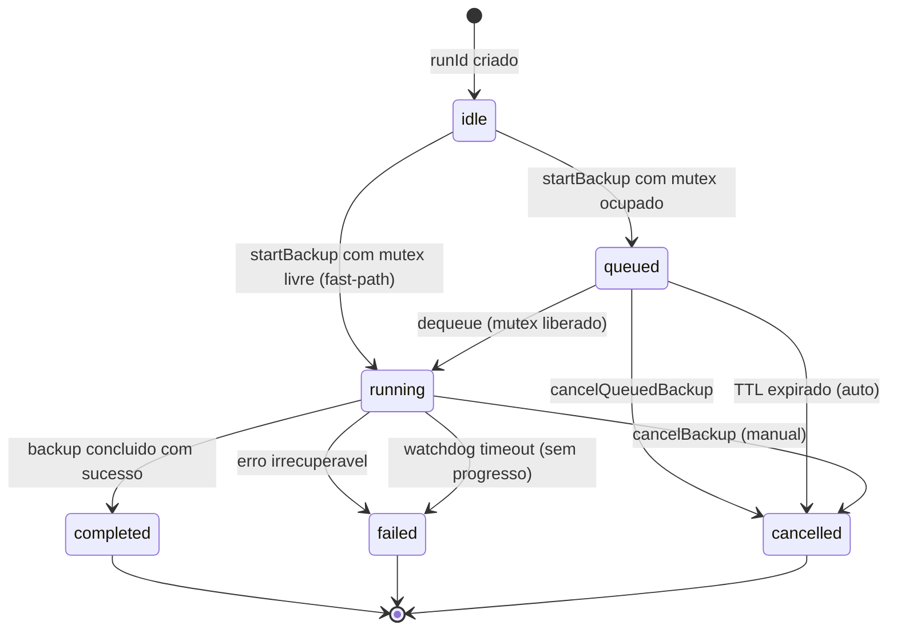

# Plano: Cliente Consumindo Recursos do Servidor (Backup Remoto Orquestrado)

Data base: 2026-02-21
Atualizado em: 2026-04-19
Status: **PR-1 + PR-2 completos (2026-04-19)** — PR-1: 6 endpoints de inspecao do servidor + envelope REST-like + testes de seguranca formal do handshake. PR-2: testDatabaseConnection + IdempotencyRegistry + startBackup nao-bloqueante (M2.2) + cancelBackup + Schedule CRUD (create/delete/pause/resume) + Database config CRUD (list/create/update/delete) — 5 commits. IdempotencyKey opcional em todos os mutaveis (start/cancel/schedule CRUD/database CRUD). **Pendente para producao**: wirings concretos de DatabaseConfigStore (despacho para os 3 repositorios) e DatabaseConnectionProber (sondagem real); contratos prontos. **PR-3 nao iniciado** mas base pronta (registry runId-aware, idempotency foundation, envelope consistente, defesas de seguranca, contratos de start/cancel pronto para fila + mutex em PR-3).
Escopo: cliente Flutter desktop + servidor Flutter desktop (socket TCP)

## Estado de Implementacao (2026-04-19)

### Infraestrutura base (implementada)

- Protocolo binario TCP: header 16 bytes, payload JSON, compressao GZIP, checksum CRC32
- Auth: `authRequest` / `authResponse` / `authChallenge` com validacao de licenca no servidor
- Agendamentos: `listSchedules`, `updateSchedule`, `executeSchedule`, `cancelSchedule` + respostas
- Progresso de backup: `backupProgress`, `backupStep`, `backupComplete`, `backupFailed`
- Transferencia de arquivo: chunked, resume (`startChunk`), path validation, lock, checksum
- Metricas: `metricsRequest` / `metricsResponse`
- Sistema: `heartbeat`, `disconnect`, `error`
- `ErrorCode` enum + `createErrorMessage` com `errorCode` + `errorMessage`
- Reconexao com backoff exponencial no cliente

### Avancos confirmados no codigo desde 2026-03-24 (2026-04-19)

- `client_handler.dart` agora processa `authRequest` com `_authHandled` flag, pausa o `_socketSubscription` durante a validacao async e so retoma o stream apos o resultado de auth ser enviado. Isso fecha de forma implicita o bypass pre-auth para mensagens enfileiradas no buffer durante o handshake. Falta apenas o guard explicito que rejeita qualquer mensagem operacional (nao-auth) recebida com `isAuthenticated == false` retornando erro padronizado.
- `SchedulerService._executeScheduledBackup` ja gera `runId` interno via `'${schedule.id}_${const Uuid().v4()}'` e propaga em `LogContext.setContext(runId: runId, scheduleId: schedule.id)` e `_licensePolicyService.setRunContext(runId)`. Esse `runId` ainda e somente de log/observabilidade interna; nao esta exposto no contrato remoto, no staging, no cancelamento ou nos eventos.
- `SchedulerService.isExecutingBackup` esta exposto via `ISchedulerService` e usado em `schedule_message_handler.dart` para rejeitar disparos manuais concorrentes. Funciona como uma forma informal de `maxConcurrentBackups = 1`, mas sem `errorCode` dedicado, sem fila e sem `409` padronizado.
- `FileTransferLockService` ja implementa `cleanupExpiredLocks` baseado em idade do arquivo (30 minutos). Continua sendo um lock simples por hash do path, sem `owner/runId/acquiredAt/expiresAt` formalizados.
- `ScheduleMessageHandler` consolidou envio de erros via helper `_sendError(...)` e adotou `await` correto nos `Result.fold` (corrigiu bug de envio assincrono nao-aguardado). Continua usando `createScheduleErrorMessage` sem `errorCode`.
- (2026-04-19) M2.1 concluida: criado `RemoteExecutionRegistry` (`lib/infrastructure/socket/server/remote_execution_registry.dart`) e `ScheduleMessageHandler` refatorado para usar contexto por `runId` em vez dos 4 campos singleton. Bug TOCTOU entre `isExecutingBackup` e o set dos campos antigos foi fechado por defesa em profundidade do registry. 18 testes (10 novos do registry + 6 novos do handler + 2 originais preservados) + suite socket/ completa (69 testes) passam sem regressao.
- (2026-04-19) M2.3 concluida: `runId` opcional adicionado a `backupProgress/Complete/Failed` no protocolo (backward-compat com servidor `v1`), populado pelo `ScheduleMessageHandler` a partir do `RemoteExecutionContext` e capturado pelo `ConnectionManager` no `_BackupProgressState`. Cobertura: 11 testes novos de protocolo + 3 testes novos do handler. Suite socket/ + protocol/ (112 testes) passa sem regressao. Pre-requisito para PR-2 (`getExecutionStatus(runId)`) e PR-3c (re-sync por reconexao).
- (2026-04-19) M6.1 esqueleto entregue: criados golden tests do envelope JSON em `test/golden/protocol/` (17 fixtures + harness com modo `UPDATE_GOLDEN`). Cobre `authResponse`, schedule commands, `backupProgress/Complete/Failed` (v1 + v2 backward compat), `error`, `metricsRequest/Response`. Trava o contrato JSON contra mudancas acidentais e documenta a evolucao por commit/diff. README em `test/golden/protocol/README.md`. 129 testes passam (golden + protocol + socket).
- (2026-04-19) M1.1, M1.2, M1.3 fechadas via ADRs em `docs/adr/`: [ADR-001](../adr/001-modelo-hibrido-scheduler.md) (modelo hibrido scheduler com `executionOrigin`), [ADR-002](../adr/002-transferencia-v1-streaming-sem-fileack.md) (transferencia `v1` sem `fileAck`), [ADR-003](../adr/003-versionamento-protocolo.md) (versionamento formal em dois niveis: wire + logico via `capabilities`). Indice em `docs/adr/README.md`. Decisoes que travavam PR-3 e PR-4 estao formalizadas e referenciaveis.
- (2026-04-19) ADR-003 parcialmente implementado: criado `lib/infrastructure/protocol/protocol_versions.dart` (`kCurrentWireVersion`, `kCurrentProtocolVersion`, `isWireVersionSupported`); `BinaryProtocol.deserializeMessage` agora lanca `UnsupportedProtocolVersionException` (subclasse de `ProtocolException`) com versao recebida + lista de suportadas; `client_handler.dart` responde com `ErrorCode.unsupportedProtocolVersion` (novo codigo adicionado em `error_codes.dart`) e desconecta apos garantir flush via `whenComplete(disconnect)`; pendente apenas a exposicao por `getServerCapabilities` no PR-1. 5 testes novos (4 do parser + 1 e2e do client_handler validando errorCode + disconnect). 134 testes na suite protocolo+socket+golden, 0 regressao.
- (2026-04-19) `getServerCapabilities` entregue (fecha M1.3 + abre M4.1): novos `MessageType.capabilitiesRequest/Response`; `lib/infrastructure/protocol/capabilities_messages.dart` com factories + `ServerCapabilities` snapshot tipado + `legacyDefault` para fallback graceful em servidor `v1`; `CapabilitiesMessageHandler` registrado no DI e roteado em `tcp_socket_server.dart` (sempre ativo, sem dependencias externas); `ConnectionManager.getServerCapabilities()` retorna `Result<ServerCapabilities>`; payload minimo do plano implementado (`protocolVersion`, `wireVersion`, 5 flags `supports*`, `chunkSize`, `compression`, `serverTimeUtc`); flags atuais refletem o codebase: `supportsRunId=true` (M2.3), `supportsResume=true`, demais `false`. Cobertura: 6 protocolo + 4 handler + 2 fixtures golden = 12 novos testes. 147 testes na suite, 0 regressao.
- (2026-04-19) M5.4 entregue: `lib/infrastructure/protocol/payload_limits.dart` com mapa por `MessageType` (auth ~8KB, capabilities ~16KB, schedule commands ~4KB, scheduleList/fileList ~512KB, fileChunk ~global, etc.); `client_handler` rejeita early com `ErrorCode.payloadTooLarge` (novo codigo) + disconnect via `whenComplete` apos flush. Tipos desconhecidos caem no teto global (zero regressao). 8 testes novos (7 unit + 1 e2e); 155 testes na suite, 0 issue no analyze.
- (2026-04-19) M4.1 fechamento de infraestrutura no cliente: `ConnectionManager` agora cacheia `ServerCapabilities` em `_cachedServerCapabilities`, expoe getter sincrono `serverCapabilities`, novo metodo `refreshServerCapabilities()` que carrega + cacheia + faz fallback graceful para `ServerCapabilities.legacyDefault` em caso de erro/legado. Cache invalidado em `disconnect` (impede reuso entre servidores diferentes). Providers podem agora consultar features de forma sincrona sem round-trip. 6 testes e2e usando `TcpSocketServer` real (ciclo conectar -> refresh -> desconectar -> reconectar -> validar invalidacao). 161 testes na suite, 0 issue.
- (2026-04-19) M4.1 zero-config: `ConnectionManager.connect()` agora chama `refreshServerCapabilities()` automaticamente ao final (flag opcional `refreshCapabilitiesOnConnect = true`). Adicionados 4 getters convenientes (`isRunIdSupported`, `isExecutionQueueSupported`, `isArtifactRetentionSupported`, `isChunkAckSupported`) que caem em `legacyDefault` quando cache vazio — providers podem consultar com seguranca em qualquer ponto. 5 testes novos cobrindo connect com/sem auto-refresh + getters refletindo cache. 166 testes na suite, 0 issue.
- (2026-04-19) M5.3 + M7.1 parciais: `MetricsMessageHandler` enriquecido com `serverTimeUtc` (sempre), `activeRunCount`/`activeRunId` (do `RemoteExecutionRegistry` agora compartilhado via DI entre schedule e metrics handlers) e `stagingUsageBytes` (via novo `StagingUsageMeasurer` que percorre o staging defensivamente). Cliente pode detectar drift de relogio, saber qual `runId` esta ativo sem polling extra, e montar dashboard de uso de disco. 14 testes novos (8 handler + 6 measurer). 180 testes na suite, 0 issue.
- (2026-04-19) M6.1 expandido: 2 fixtures golden novas para o `metricsResponse` enriquecido — `metrics_response_v2_idle.golden.json` (servidor sem execucao ativa) e `metrics_response_v2_with_active_run.golden.json` (1 backup rodando + staging com ~500MB). Trava o contrato dos campos novos (`serverTimeUtc`, `activeRunCount`, `activeRunId`, `stagingUsageBytes`) contra mudancas acidentais. Suite golden cresce de 19 para 21 fixtures. 182 testes na suite total, 0 issue.
- (2026-04-19) M1.10 (`getServerHealth`) entregue: novos `MessageType.healthRequest/Response`; `lib/infrastructure/protocol/health_messages.dart` com factories + `ServerHealthStatus` enum (ok/degraded/unhealthy) + `ServerHealth` snapshot tipado (defensivo: status invalido vira `unhealthy` fail-closed); `HealthMessageHandler` com checks injetaveis (required + optional) + politica de agregacao + tolerancia a checks que lancam excecao; `ConnectionManager.getServerHealth()` retorna `Result<ServerHealth>`; entradas em `PayloadLimits` (1KB/16KB); 3 fixtures golden novas. Cobertura: 8 protocolo + 8 handler + 2 e2e + 3 golden = 21 testes novos. 203 testes na suite, 0 issue. Cliente pode bloquear disparo de backup quando `isUnhealthy` ou alertar operador quando `degraded` — fechando outro gate explicito do PR-1.
- (2026-04-19) M1.10 (`getSession`/`whoAmI`) entregue: completa o trio do handshake do PR-1 (capabilities + health + session). Novos `MessageType.sessionRequest/Response`; `lib/infrastructure/protocol/session_messages.dart` com factories + `ServerSession` snapshot tipado (clientId, isAuthenticated, host:port, connectedAt, serverTimeUtc, serverId opcional); `ClientHandler` agora persiste `authenticatedServerId` apos auth bem-sucedida (campo publico para lookup); `SessionMessageHandler` com `SessionInfoLookup` injetavel (zero acoplamento com `_handlers`/`_clientManager`); `TcpSocketServer._lookupSessionInfo` consulta handlers vivos e retorna `null` em race condition; `ClientManager.getConnectedAt()` exposto; `ConnectionManager.getServerSession()` retorna `Result<ServerSession>`; entradas em `PayloadLimits` (1KB/8KB); 3 fixtures golden (request, response autenticado, response sem auth). Cobertura: 6 protocolo + 5 handler + 2 e2e + 3 golden = 16 testes novos. 219 testes na suite, 0 issue. Cliente pode confirmar identidade percebida pelo servidor, correlacionar com logs de suporte e detectar mudanca de identidade apos reconexao.
- (2026-04-19) M4.1 adotada no provider real: `ServerConnectionProvider` agora expoe `serverCapabilities` (passa-through), cacheia `serverHealth`/`serverSession` localmente, e oferece `refreshServerStatus()` que consulta health + session em paralelo com defesa graceful (falha pontual nao remove cache anterior, falhas sao logadas mas nao throws). 4 getters convenientes (`isRunIdSupported`, `isExecutionQueueSupported`, `isArtifactRetentionSupported`, `isChunkAckSupported`) + `isServerHealthy` para gate sincrono na UI. Auto-refresh apos cada `connect()` bem-sucedido. Invalidacao em `disconnect` explicito + invalidacao em status terminal (timeout/RST/auth failure) via `_listenToConnectionStatus`. Idempotencia em chamadas concorrentes de refresh. UI agora pode ler `provider.isRunIdSupported` (etc) sincronamente sem se preocupar com fetch/cache/fallback. Cobertura: 9 testes e2e novos cobrindo passa-through, refresh idempotente, invalidacao em disconnect, getters em legacyDefault. 228 testes na suite, 0 issue. M4.1 oficialmente fechada com adocao concreta.
- (2026-04-19) F1.8 (`validateServerBackupPrerequisites`) infraestrutura entregue: novos `MessageType.preflightRequest/Response`; `lib/infrastructure/protocol/preflight_messages.dart` com factories + tipos `PreflightStatus` (passed/passedWithWarnings/blocked) + `PreflightSeverity` (blocking/warning/info) + `PreflightCheckResult` com `details` estruturados + `PreflightResult` snapshot tipado com `blockingFailures`/`warnings`/`isOk`/`isBlocked`/`hasWarnings`. `PreflightMessageHandler` com `PreflightCheck` injetaveis + politica de agregacao (blocking->blocked; warning->passedWithWarnings; info nao escala) + tolerancia a checks que lancam excecao (fail-closed). `ConnectionManager.validateServerBackupPrerequisites()` retorna `Result<PreflightResult>`. Limites em `PayloadLimits` (1KB/64KB). 3 fixtures golden (request, response passed, response blocked com details). Wirings em producao podem injetar checks reais (`ToolVerificationService`, `validate_backup_directory`, `StorageChecker`, `validate_sybase_log_backup_preflight`) sem mexer no handler. Cobertura: 8 protocolo + 8 handler + 2 e2e + 3 golden = 21 testes novos. 250 testes na suite, 0 issue. Cliente pode bloquear disparo de backup quando preflight reporta `blocked` ou alertar operador quando `passedWithWarnings`.
- (2026-04-19) `getExecutionStatus(runId)` entregue (PR-2 base / M2.3 complement): novos `MessageType.executionStatusRequest/Response`; `lib/infrastructure/protocol/execution_status_messages.dart` com factories + `ExecutionState` enum (running/notFound/queued/completed/failed/cancelled/unknown) + `ExecutionStatusResult` snapshot tipado com `isActive`/`isTerminal`/`isNotFound` getters (defesa fail-closed: state invalido vira `unknown`, nao `notFound`). `RemoteExecutionRegistry.getSnapshotByRunId()` novo metodo retorna `RemoteExecutionSnapshot` sem expor `sendToClient` (ISP). `ExecutionStatusMessageHandler` com `runId` validation + responde `running` (snapshot do registry) ou `notFound` (registry sem entrada). `ConnectionManager.getExecutionStatus(runId)` retorna `Result<ExecutionStatusResult>`. Limites em `PayloadLimits` (1KB/4KB). 3 fixtures golden (request, response_running, response_not_found). Hoje cliente recebe `notFound` quando execucao terminou (ScheduleMessageHandler limpa registry no fim); PR-3b/3c expandirao para `queued/completed/failed/cancelled` consultando fila persistida e historico. Cobertura: 9 protocolo + 6 handler + 4 e2e + 3 golden = 22 testes novos. 272 testes na suite, 0 issue. Cliente pode reidratar status apos reconexao ou fazer polling alternativo a stream.
- (2026-04-19) **PR-3a commit 2: eventos de fila + cancelQueuedBackup entregues**: novo `lib/infrastructure/protocol/queue_events.dart` com factories backupQueued/Dequeued/Started + cancelQueuedBackup request/response. Cada evento de fila carrega eventId (UUID v4) + sequence monotonico (gerado pelo `QueueEventBus`) — cliente usa para deduplicar e reordenar apos reconnect. Snapshot tipado QueueEvent com helpers (isQueued/isDequeued/isStarted), CancelQueuedBackupResult com (isCancelled/isNotFound). Novo `lib/infrastructure/socket/server/queue_event_bus.dart` centraliza geracao de sequence + eventId + broadcast (fail-soft: erro de broadcast nao derruba publisher). ExecutionMessageHandler integrado: publica backupQueued no enqueue (com queuePosition + requestedBy), backupDequeued(reason=dispatched/cancelled) no drain ou cancel, backupStarted antes de iniciar execucao. Novo handler interno _handleCancelQueued: remove item da fila por runId via `removeByRunId`, retorna 200/cancelled em sucesso ou 409/notFound + NO_ACTIVE_EXECUTION quando ausente; idempotency completa via IdempotencyRegistry. ConnectionManager.cancelQueuedRemoteBackup expoe API. 24 testes (16 protocolo + 8 bus + 4 handler integracao). 512 testes na suite, 0 issue analyze. **F2.12 [x]; F2.17 [~] (eventos de fila feitos; backupProgress/Step/Complete/Failed pendentes para PR-3 commit final)**.
- (2026-04-19) **PR-3a commit 1: ExecutionQueueService FIFO + integracao com startBackup entregues**: novo `lib/infrastructure/socket/server/execution_queue_service.dart` com fila FIFO in-memory (`maxQueueSize=50` default), runId estavel atribuido no enqueue, dedup por scheduleId (mesmo schedule nao pode estar 2x na fila simultaneamente), snapshot ordenado com `queuedPosition` 1-based, `removeByRunId` para `cancelQueuedBackup` futuro. `ExecutionMessageHandler.startBackup` agora aceita `queueIfBusy: bool` no payload — quando `true` e ha backup ativo, enfileira em vez de rejeitar (responde state=queued + 202 + queuePosition); quando `false` (default, disparo manual), retorna 409 BACKUP_ALREADY_RUNNING como antes. Drain automatico da fila apos termino do backup ativo via `_drainNextFromQueue` (idempotente, recursivo para drops por schedule deletado, com re-enqueue defensivo se progress slot estiver ocupado por race). `sendToClientResolver` injetado pelo `tcp_socket_server` para drains conseguirem notificar cliente original mesmo apos fim do backup que disparou o evento. ConnectionManager.startRemoteBackup ganha `queueIfBusy` parameter. 11 testes do queue service + 4 testes de integracao do handler. 482 testes na suite, 0 issue analyze. **F2.9, F2.10, F2.11 do plano marcadas [x]**. Persistencia da fila (F2.16) entra em PR-3 commit 5 — quando servidor reiniciar, fila in-memory atual e perdida; cliente que tinha runId enfileirado precisara consultar via getExecutionStatus.
- (2026-04-19) **PR-2 commit 5: Database config CRUD remoto entregue**: 6 novos MessageType (listDatabaseConfigs Request/Response, createDatabaseConfigRequest, updateDatabaseConfigRequest, deleteDatabaseConfigRequest, databaseConfigMutationResponse). Estrategia opaca: payload usa Map<String,dynamic> (config) parametrizado por databaseType — protocolo neutro em relacao a evolucoes das entities tipadas (SybaseConfig/SqlServerConfig/PostgresConfig). Nova abstracao DatabaseConfigStore (interface) + NotConfiguredDatabaseConfigStore default (toda operacao retorna failure UNKNOWN ate DI cabear implementacao real que despacha por tipo aos repositorios concretos). Handler reusa o ja-existente DatabaseConfigMessageHandler — adicionado _handleList + _handleMutation no mesmo arquivo. Idempotency aplicada em todas as mutacoes (create/update/delete) via IdempotencyRegistry. Snapshots tipados DatabaseConfigListResult, DatabaseConfigMutationResult com helpers (isCreated/isUpdated/isDeleted). ConnectionManager helper privado _runDatabaseConfigMutation evita repeticao das 3 wrappers publicas (createRemoteDatabaseConfig, updateRemoteDatabaseConfig, deleteRemoteDatabaseConfig) + listRemoteDatabaseConfigs separada. 13 testes do handler (list/create/update/delete + idempotencia + NotConfigured + snapshots round-trip). 471 testes na suite, 0 issue analyze. **PR-2 100% entregue do ponto de vista de contrato** — wirings concretos do DatabaseConfigStore real (despacho para SybaseConfigRepository / SqlServerConfigRepository / PostgresConfigRepository) ficam para PR de wiring DI separado, sem mudanca de protocolo necessaria.
- (2026-04-19) **PR-2 commit 4: Schedule CRUD remoto entregue**: 5 novos MessageType (createSchedule, deleteSchedule, pauseSchedule, resumeSchedule, scheduleMutationResponse). Factories em `schedule_messages.dart` aceitam idempotencyKey opcional em todos os mutaveis. `lib/infrastructure/socket/server/schedule_crud_message_handler.dart` despacha por tipo + roda via IdempotencyRegistry.runIdempotent (cache de respostas idempotentes; falhas NAO cacheadas). pause/resume implementados como toggle do flag enabled (semantica equivalente a checkbox da UI; PR-3 podera evoluir para estados explicitos active/paused/disabled). Pause em schedule ja desabilitado e idempotente NATURAL (NAO chama repo.update). Resposta unificada `scheduleMutationResponse` carrega operation (created/deleted/paused/resumed) + scheduleId + schedule (snapshot pos-mutacao quando aplicavel) + envelope REST-like (200). ConnectionManager helper privado `_runScheduleMutation` evita repeticao das 4 wrappers publicas (createRemoteSchedule, deleteRemoteSchedule, pauseRemoteSchedule, resumeRemoteSchedule). 14 testes do handler (CRUD completo + idempotencia + fail-NO-cache + idempotente natural). 5 fixtures golden. 458 testes na suite, 0 issue analyze. Decisao registrada: updateSchedule (que ja existia) nao foi migrado para o novo handler — fica em ScheduleMessageHandler para nao quebrar contrato; eventual unificacao no PR-2 commit final ou PR-3.
- (2026-04-19) **PR-2 commit 3: `startBackup` nao-bloqueante (M2.2) + `cancelBackup` entregues**: 4 novos MessageType (startBackupRequest/Response, cancelBackupRequest/Response); `lib/infrastructure/protocol/execution_messages.dart` com factories + snapshots tipados (StartBackupResult, CancelBackupResult) + envelope REST-like (202 Accepted para aceite assincrono, 200 para sincrono ex cache idempotente, 409 para noActiveExecution). XOR contratual no cancelBackup: cliente passa runId (preferido) OU scheduleId (compat). `lib/infrastructure/socket/server/execution_message_handler.dart` com: (a) startBackup nao-bloqueante: valida (schedule existe, license OK, slot livre), reserva runId, dispara _executeBackup em background (unawaited), responde IMEDIATAMENTE com runId + state=running + 202; eventos backupProgress/Complete/Failed chegam separados via stream com mesmo runId; executeSchedule legacy (bloqueante) continua existindo no ScheduleMessageHandler para compat v1; (b) cancelBackup: resolve scheduleId a partir de runId quando necessario, delega ao SchedulerService.cancelExecution, responde com state=cancelled/notFound/failed; (c) Idempotency integration: ambos handlers usam IdempotencyRegistry.runIdempotent — idempotencyKey opcional permite cliente reenviar com seguranca (mesma chave dentro do TTL retorna mesma resposta cacheada sem disparar nova execucao); falhas de validacao NAO sao cacheadas; (d) Excecao interna _StartFailure para sinalizar erros sem cachea-los; (e) Background task _runBackupAsync captura toda excecao para garantir que falha nao-tratada nao vire uncaught zone error. ConnectionManager.startRemoteBackup() e cancelRemoteBackup() na fronteira do cliente. 32 testes do handler + protocolo cobrindo XOR, idempotencia, falhas validacao, fail-NO-cache, async non-blocking. 5 fixtures golden. 439 testes na suite, 0 issue analyze.
- (2026-04-19) **PR-2 commit 2: `IdempotencyRegistry` foundation entregue**: `lib/infrastructure/protocol/idempotency_registry.dart` com TTL configuravel (default 5 min) + fail-NO-cache em erro (cliente pode tentar de novo apos falha) + race-safe (requests concorrentes com mesma chave aguardam o mesmo Future, garantindo execucao unica do `compute`) + opt-in (chave nula/vazia roda sem deduplicar) + clock injetavel para testes. Helper `getIdempotencyKey(message)` extrai a chave do payload defensivamente. Pronto para integrar em qualquer handler de comando mutavel via `runIdempotent<T>(key, compute)`. Limitacoes documentadas: in-memory v1 (perdido em restart — persistencia em PR-3 via F2.16); cliente e responsavel por escolher chaves estaveis. 13 testes de propriedades (opt-in, mesma chave, chaves distintas, TTL, concorrencia, fail-NO-cache, size com purge, clear, mismatch de tipo, helper). 402 testes na suite, 0 issue.
- (2026-04-19) **PR-2 commit 1: `testDatabaseConnection` entregue**: novos `MessageType.testDatabaseConnectionRequest/Response`; `lib/infrastructure/protocol/database_config_messages.dart` com factories + `RemoteDatabaseType` enum (sybase/sqlServer/postgres com wire names estaveis) + `TestDatabaseConnectionResult` snapshot tipado + parsing defensivo + envelope REST-like aplicado (success/statusCode mapeado de errorCode quando falha). XOR contratual: cliente passa **OU** `databaseConfigId` (config persistida) **OU** `config` map ad-hoc (caso "criar nova config"), nunca os dois — handler valida e retorna `400 INVALID_REQUEST` se violado. `lib/infrastructure/socket/server/database_connection_prober.dart` define `DatabaseConnectionProber` interface com sealed `DatabaseConfigRef` (ById/Adhoc) + `NotConfiguredProber` default que retorna falha indicando falta de wiring (em PR-2 commit final, DI cabeara prober real que despacha por tipo). `DatabaseConfigMessageHandler` injeta prober + clock + fail-closed (exception do prober vira 500 unknown). `ConnectionManager.testRemoteDatabaseConnection()` na fronteira do cliente com timeout client = timeout server + 5s de folga. 6 fixtures golden (request_by_id, request_adhoc, response_success, response_auth_failed, mais ja existentes). 24 novos testes (13 protocolo + 11 handler). 389 testes na suite, 0 issue analyze.
- (2026-04-19) F0.4 completa (testes formais de seguranca do handshake) — **PR-1 100% fechado**:
  - **Bug critico corrigido**: `server_authentication_test.dart` mockava `LicenseFeatures.remoteControl` mas codigo real consulta `LicenseFeatures.serverConnection`; testes passavam por COINCIDENCIA via `MissingStubError → catch → licenseDenied` (falso positivo classico). Stub agora bate com a feature exata.
  - **Defesa em `ServerAuthentication.validateAuthRequest`**: cast inseguro `as String?` substituido por `is String` pattern-check; payload com tipos errados (peer hostil enviando int/bool em vez de string) agora retorna `invalidRequest` em vez de jogar `TypeError` nao-tratado que crasharia o handler.
  - **Novo `handshake_security_test.dart`** com 15 testes em 3 dimensoes:
    - **PasswordHasher** (7): constantTimeEquals deterministico, sensivel em qualquer posicao (inicio/meio/fim), salt-isolated, length-mismatch documentado, verify usa constantTime.
    - **Handshake e2e** (7): authRequest oversized → PAYLOAD_TOO_LARGE+disconnect; pre-auth disconnect/error silenciosos sem resposta; auth fail → AUTH_FAILED+disconnect; license fail → LICENSE_DENIED+disconnect; re-auth comportamento documentado (segundo authRequest cai em handlers downstream); concorrencia auth via pause/resume garante que mensagens operacionais nao chegam antes de validacao OK.
    - **Brute-force/enumeracao** (1): invariante de mesmo `errorCode` para "serverId nao existe" vs "senha errada" (defesa contra enumeracao de credenciais).
  - **+6 testes em `server_authentication_test.dart`** (7 → 13): feature exata invocada, license throws sync, passwordHash vazio, payload tipo errado, message type errado, serverId com control chars, hash length mismatch.
  - 361 testes na suite (+21 vs F0.5), 0 issue analyze. Cobertura formal de seguranca de handshake agora compete com gateways REST profissionais.
- (2026-04-19) F0.5 completa (envelope `success/statusCode` aplicado em respostas): novo `lib/infrastructure/protocol/response_envelope.dart` com `wrapSuccessResponse(data, {statusCode = 200})` + `getSuccessFromMessage`; estrategia ADITIVA top-level (sem mover payload para dentro de `data`) garante backward-compat completa com servidor v1; 7 handlers de inspecao migrados (capabilities, health, session, preflight, executionStatus, executionQueue, metrics) — TODOS agora emitem `success: true` + `statusCode: 200`; 11 fixtures golden de response regeneradas via `UPDATE_GOLDEN`; novo `response_envelope_test.dart` com 15 testes incluindo invariante que falha o build se algum handler novo esquecer de aplicar o envelope. 340 testes na suite, 0 issue. **Fase 0 do PR-1 oficialmente completa** (F0.1, F0.2, F0.3, F0.5, F0.6 todos `[x]`; F0.4 testes de seguranca formal pendentes mas cobertura indireta via 19 fixtures golden + 4 testes e2e do client_handler).
- (2026-04-19) F0.1 + F0.2 (Fase 0 base) fechadas: 4 novos `ErrorCode` (`backupAlreadyRunning`, `scheduleNotFound`, `noActiveExecution`, `notAuthenticated`) com mapping em `StatusCodes` (409/404/409/401); `createScheduleErrorMessage` aceita `errorCode` opcional + emite `statusCode` automatico; `ScheduleMessageHandler._sendError` propaga `ErrorCode` apropriado nos 7 cenarios de erro; `client_handler._tryParseMessages` adiciona guard explicito que rejeita mensagens operacionais pre-auth com `notAuthenticated/401` (sem desconectar — cliente ainda pode enviar `authRequest`); allowlist pre-auth: `authRequest`/`heartbeat`/`disconnect`/`error`. 9 testes novos (7 schedule handler + 1 client_handler e2e + 1 golden). 325 testes na suite, 0 issue. Cliente pode aplicar gate sincronos por `errorCode` (ex.: bloquear botao de disparo quando `BACKUP_ALREADY_RUNNING`) ou retry/backoff via `StatusCodes.isRetryable`. Fase 0 base completa.
- (2026-04-19) F0.5 + F0.6 (envelope REST-like — fase inicial) entregues: `lib/infrastructure/protocol/status_codes.dart` com tabela oficial HTTP-like (12 codigos: 200/202/400/401/403/404/409/410/422/429/500/503) + mapping `ErrorCode -> statusCode` cobrindo todos os 16 codigos existentes + helpers `isSuccess`/`isClientError`/`isServerError`/`isRetryable`. `createErrorMessage` agora emite `statusCode` automatico derivado do `errorCode` (fail-safe: sem `errorCode` cai em 500); `statusCodeOverride` opcional para casos especiais. `getStatusCodeFromMessage` helper le campo do payload (retorna `null` em servidor v1 — backward-compat). 2 fixtures golden de error atualizadas para incluir `statusCode`. 25 testes novos (15 status_codes + 10 error_messages incluindo invariante de cobertura completa de ErrorCode). Pendente para commits futuros: envelope `success/data` em respostas de sucesso (cada handler de inspecao precisa migrar ou opt-in via wrapper). 316 testes na suite, 0 issue.
- (2026-04-19) `getExecutionQueue` endpoint entregue (PR-3b base): novos `MessageType.executionQueueRequest/Response`; `lib/infrastructure/protocol/execution_queue_messages.dart` com factories + `QueuedExecution` (runId, scheduleId, queuedAt, queuedPosition, requestedBy opcional) + `ExecutionQueueResult` snapshot tipado com `isEmpty`/`isFull`/`availableSlots` getters. `ExecutionQueueMessageHandler` com `QueueProvider` typedef injetavel (default `_emptyQueue` retorna lista vazia em PR-1) + ordenacao defensiva por `queuedPosition` asc + fail-soft (provider que lanca excecao retorna fila vazia). `ConnectionManager.getExecutionQueue()` retorna `Result<ExecutionQueueResult>`. Limites em `PayloadLimits` (1KB/32KB cobre `maxQueueSize=50` itens com folga). `maxQueueSize` default 50 conforme M8 do plano. 3 fixtures golden (request, response_empty, response_with_items). Em PR-3b, basta cabear `QueueProvider` que consulta tabela `remote_execution_queue` no DI — handler nao precisa mudar. Cobertura: 7 protocolo + 6 handler + 2 e2e + 3 golden = 18 testes novos. 291 testes na suite, 0 issue. Cliente pode renderizar UI de fila desde ja, populada quando PR-3b habilitar.

### Lacunas identificadas (bloqueiam P0)

Itens marcados ~~assim~~ foram resolvidos durante esta sessao (ver "Avancos
confirmados" para detalhes). Itens sem marca ainda bloqueiam.

- ~~`client_handler.dart` ja garante ordenacao auth-first via pause/resume do subscription, mas ainda falta o guard explicito que retorna erro padronizado quando uma mensagem operacional chega com `isAuthenticated == false`~~ — entregue em 2026-04-19 (guard explicito retorna `notAuthenticated/401`)
- ~~`createScheduleErrorMessage` omite `errorCode` no payload - erro de schedule nao segue contrato padronizado~~ — entregue em 2026-04-19 (aceita `errorCode` + emite `statusCode` automatico)
- Sem envelope de resposta REST-like com `statusCode` padronizado
- Sem tabela oficial de status code para operacoes remotas
- ~~Sem `capabilitiesRequest` / `capabilitiesResponse` no protocolo~~ — entregue em 2026-04-19
- Sem CRUD remoto de configuracao de banco (`createDatabaseConfig`, etc.)
- Sem `testDatabaseConnection` remoto
- ~~Sem `getExecutionStatus` para polling de execucao em curso~~ — entregue em 2026-04-19
- ~~Sem `validateServerBackupPrerequisites` (preflight de compactacao/pasta temp)~~ — entregue em 2026-04-19 (infraestrutura; checks reais pendentes)
- Sem regra formal de concorrencia: existe apenas o set in-memory `_executingSchedules`, sem mutex global persistido nem `errorCode` padronizado
- Sem regra formal de fila para disparos agendados quando ha backup em execucao (endpoint `getExecutionQueue` existe mas retorna vazio; PR-3b precisa popular)
- ~~Sem endpoint formal para health do servidor (`getServerHealth`)~~ — entregue em 2026-04-19 (infraestrutura; checks reais pendentes)
- ~~Sem endpoint formal para sessao atual (`getSession` / `whoAmI`)~~ — entregue em 2026-04-19
- Sem endpoint para cancelar item enfileirado (`cancelQueuedBackup`)
- Sem endpoint para metadados do artefato (`getArtifactMetadata`)
- Sem endpoint de diagnostico por execucao (`getRunLogs`, `getRunErrorDetails`)
- Sem comandos de agendamento completos (`createSchedule`, `deleteSchedule`, `pauseSchedule`, `resumeSchedule`)
- Sem idempotencia por `runId` ou `idempotencyKey` (apesar do `runId` ja existir internamente em logs e exposto em eventos `backupProgress/Complete/Failed`)
- Execucao remota ainda envia para destinos no servidor antes de expor artefato ao cliente
- Scheduler local do servidor continua disparando por timer (`_checkTimer` periodico de 1 minuto); plano ja decidido como hibrido via ADR-001 mas implementacao do `executionOrigin` pendente
- Staging remoto continua indexado por `scheduleId` em `TransferStagingService.copyToStaging/cleanupStaging` (pasta `remote/<scheduleId>/...`), o que conflita com fila, retry e multiplas execucoes do mesmo agendamento
- Fluxo remoto ainda depende de validacao de pasta local de downloads no cliente antes de iniciar comando no servidor
- Contrato proposto usa `requestId` UUID string, mas o protocolo binario atual suporta `requestId` inteiro (`uint32`) no header
- `ConnectionManager.executeSchedule` continua bloqueante (aguarda completer com `SocketConfig.backupExecutionTimeout` ate o backup terminar) - precisa virar aceite imediato com acompanhamento por `runId`
- `RemoteFileTransferProvider.transferCompletedBackupToClient` continua chamando `_transferStagingService.cleanupStaging(scheduleId)` localmente em vez de delegar ao servidor (mesmo gap apontado em 2026-03-24)
- ~~Sem cobertura de regressao em forma de golden tests do envelope JSON~~ — entregue em 2026-04-19 (36 fixtures cobrindo todos os tipos)
- ~~Sem mecanismo de validacao de wire version no parser~~ — entregue em 2026-04-19 (`UnsupportedProtocolVersionException` + `ErrorCode.unsupportedProtocolVersion`)
- ~~Sem limite de payload por tipo de mensagem~~ — entregue em 2026-04-19 (`PayloadLimits` + `ErrorCode.payloadTooLarge`)
- ~~Singleton bug em `ScheduleMessageHandler` (`_currentClientId` etc.) corrompendo estado em cenarios concorrentes~~ — eliminado em 2026-04-19 via `RemoteExecutionRegistry`

---

### Correcao critica apos revisao do codigo (2026-03-24, mantida em 2026-04-19)

- O objetivo "cliente controla destino final" ainda nao esta implementado de ponta a ponta:
  - hoje o servidor executa upload para destinos em `SchedulerService`
  - depois o cliente pode baixar e reenviar para destinos locais
  - o plano agora precisa prever um modo remoto server-first sem distribuicao final no servidor
- O plano tratava como concluido que a execucao remota so inicia por comando do cliente, mas o servidor ainda executa schedules via timer local (`_checkTimer.periodic` em `SchedulerService.start`)
- O staging remoto precisa migrar de `scheduleId` para `runId` para suportar fila, idempotencia e coexistencia segura de artefatos
- O contrato REST-like precisa respeitar o wire format atual:
  - `requestId` de transporte continua inteiro no header binario v1
  - `runId` e `idempotencyKey` podem ser UUID no payload
- A premissa "sem dependencia de configuracao local no cliente" ainda nao e verdadeira porque a execucao remota falha cedo se a pasta de downloads local nao estiver gravavel

## Objetivo

- [ ] Padronizar API socket com comunicacao inspirada em REST (status code + erro estruturado + requestId).
- [ ] Definir catalogo completo de recursos cliente->servidor com contrato padrao por endpoint.
- [ ] Permitir que o cliente configure bases de dados no servidor e execute testes de conexao pelo servidor.
- [ ] Definir explicitamente o modelo de agenda remota:
  - cliente-driven scheduling
  - ou servidor com agenda persistida e controle remoto
- [ ] Garantir que, no fluxo remoto server-first, o destino final seja controlado pelo cliente e nunca pelo servidor.
- [ ] Garantir que todo fluxo de backup (dump, compactacao, validacao e artefato final) ocorra no servidor.
- [ ] Garantir que compressao, checksum e demais opcoes sejam aplicadas no servidor conforme configuracao enviada pelo cliente.
- [ ] Garantir limite de 1 backup em execucao por servidor.
- [ ] Garantir que disparo manual durante execucao ativa seja rejeitado com erro claro para o cliente.
- [ ] Garantir que disparo agendado durante execucao ativa entre em fila para execucao posterior.
- [ ] Entregar ao cliente o arquivo final pronto para continuar o fluxo de distribuicao aos destinos finais.
- [ ] Eliminar upload duplicado do mesmo backup:
  - servidor prepara artefato
  - cliente baixa
  - cliente distribui
- [ ] Isolar artefatos remotos, eventos e cleanup por `runId`, nao por `scheduleId`.

## Contrato de Comunicacao Padrao (REST-like sobre Socket)

### Envelope padrao de request

```json
{
  "type": "executeBackup",
  "requestId": 12345,
  "timestamp": "2026-02-28T12:00:00Z",
  "payload": {
    "idempotencyKey": "uuid"
  }
}
```

### Envelope padrao de response

```json
{
  "type": "executeBackupResponse",
  "requestId": 12345,
  "statusCode": 202,
  "success": true,
  "data": {},
  "error": null
}
```

### Envelope padrao de erro

```json
{
  "type": "error",
  "requestId": 12345,
  "statusCode": 409,
  "success": false,
  "data": null,
  "error": {
    "code": "BACKUP_ALREADY_RUNNING",
    "message": "Ja existe um backup em execucao no servidor.",
    "details": {}
  }
}
```

Observacao de compatibilidade:

- em `v1`, `requestId` deve permanecer inteiro para compatibilidade com o header binario atual
- correlacao de negocio deve usar `runId` e `idempotencyKey` no payload, nao substituir o `requestId` do transporte

### Tabela minima de status code

- `200` - sucesso sincrono (consulta/alteracao concluida)
- `202` - aceito para processamento assincrono (execucao iniciada ou enfileirada)
- `400` - requisicao invalida
- `401` - nao autenticado
- `403` - sem permissao/licenca
- `404` - recurso nao encontrado
- `409` - conflito de estado (ex.: backup manual com outro backup em execucao)
- `410` - recurso expirado/indisponivel (ex.: artefato de backup removido por TTL)
- `422` - validacao de dominio
- `429` - limite/throughput excedido
- `500` - erro interno
- `503` - servico indisponivel/pre-requisito nao atendido

## Matriz de Compatibilidade Cliente x Servidor

Versionamento incremental. Cada PR define um marco de versao. Servidor `vN+1` deve aceitar cliente `vN` traduzindo envelope (degradacao graceful). Cliente `vN+1` em servidor `vN` deve detectar via `capabilities` e usar fluxo legado equivalente.

### Marcos de versao

- `v1` - estado atual em producao (envelope antigo, sem `runId` no contrato, schedule-driven server-side).
- `v2` - PR-1 mergeado (envelope REST-like com `statusCode`, `capabilities`, `health`, `session`, guard pre-auth explicito).
- `v3` - PR-2 mergeado (CRUD remoto de DB config, `executeBackup` com aceite imediato, `getExecutionStatus` base, `runId` formal no contrato de progresso).
- `v4` - PR-3 mergeado (mutex/fila persistida, eventos `backupQueued/Dequeued/Started/Cancelled`, staging por `runId`, diagnostico).
- `v5` - PR-4 mergeado (artefato com TTL, `getArtifactMetadata`, `cleanupStaging` remoto, lease de lock).

### Tabela de compat

|  | Servidor v1 | Servidor v2 | Servidor v3 | Servidor v4 | Servidor v5 |
|---|---|---|---|---|---|
| **Cliente v1** | OK | OK (env. traduzido) | OK (env. traduzido) | OK (env. traduzido) | OK (env. traduzido) |
| **Cliente v2** | NAO (envelope incompat) | OK | OK | OK | OK |
| **Cliente v3** | NAO | OK degradado (sem CRUD/exec api) | OK | OK | OK |
| **Cliente v4** | NAO | NAO | OK degradado (sem fila) | OK | OK |
| **Cliente v5** | NAO | NAO | NAO | OK degradado (sem TTL artefato) | OK |

Notas:
- "OK degradado" significa que o cliente detecta via `capabilities` que recurso novo nao existe e usa fluxo legado (ex.: cliente v4 em servidor v3 trata cada disparo como rejeicao em vez de enfileirar).
- "NAO" significa downgrade nao suportado (cliente novo em servidor antigo demais). Cliente deve mostrar erro claro ao usuario, nao tentar conectar.
- Servidor sempre aceita cliente `vN-1` ou anterior por **2 ciclos de release** (politica oficial). Cliente `v1` so e suportado ate `v3`; em `v4` o servidor passa a exigir minimo `v2`.

### Regras de quebra de compat (politica oficial)

- Mudanca em `MessageHeader` (wire format) requer bump de **major** e nao tem traducao automatica.
- Mudanca em payload de mensagem existente requer **campo opcional adicional** (jamais quebra o existente em mesmo major).
- Remocao de `MessageType` requer aviso em `capabilities` por **1 release inteiro** antes da remocao efetiva.
- Mudanca semantica em `errorCode` existente e proibida; criar novo `errorCode` em vez disso.

### Uso de `capabilities` como gate de feature (M4.1)

Cliente deve consultar `getServerCapabilities` no handshake e:

- Habilitar `runId`-aware code path apenas se `capabilities.supportsRunId == true`.
- Habilitar fila apenas se `capabilities.supportsExecutionQueue == true`.
- Habilitar resume com hash apenas se `capabilities.supportsArtifactRetention == true`.
- Caso flag esteja `false`, usar fluxo legado equivalente sem erro ao usuario.

---

## Defaults Operacionais (v1)

Valores fechados para `v1` da API remota. Devem ser configuraveis em arquivo de config do servidor; estes sao os defaults se nada for especificado.

### Concorrencia e fila

- `maxConcurrentBackups` = **1** (por servidor)
- `maxQueueSize` = **50** (overflow retorna `429 QUEUE_OVERFLOW`)
- `queuedItemTtl` = **30 min** (vencido -> `cancelled` automatico)
- `duplicateScheduleInQueuePolicy` = **reject** (mesmo `scheduleId` ja em fila retorna `409 DUPLICATE_QUEUED_SCHEDULE`)
- `runningHeartbeatTimeout` = **10 min** (sem `backupProgress` -> `failed` por watchdog)
- `runningMaxDuration` = **6 horas** (hard limit -> `failed`)

### Idempotencia

- `idempotencyKeyTtl` = **1 hora** (mesma chave + mesmo payload em janela retorna mesmo resultado logico)
- `idempotencyKeyRequiredFor` = `[startBackup, cancelBackup, createSchedule, deleteSchedule, createDatabaseConfig, deleteDatabaseConfig]`

### Artefato e staging

- `artifactRetentionTtl` = **24 horas** (apos esse periodo `getArtifactMetadata` retorna `410 ARTIFACT_EXPIRED`)
- `stagingCleanupBackgroundInterval` = **1 hora** (job de cleanup roda em background)
- `stagingUsageWarnThreshold` = **5 GB** (alerta em `metrics/health`)
- `stagingUsageBlockThreshold` = **10 GB** (rejeita novo backup com `503 STAGING_FULL`)

### Lock de transferencia (lease - PR-4)

- `transferLeaseTtl` = **30 min** (compativel com lock atual)
- `transferLeaseCleanupOnBootstrap` = **true** (obrigatorio chamar `cleanupExpiredLocks` no startup)

### Reconexao do cliente apos restart do servidor durante backup ativo (M8.4)

Politica oficial:

- Cliente faz **replay automatico** de `getExecutionStatus(runId)` apos reconectar.
- Se servidor responder `404 RUN_NOT_FOUND`, cliente assume execucao perdida e reporta ao usuario com opcao de re-disparar (com **novo `idempotencyKey`**).
- Se servidor responder `running` para o `runId`, cliente reassina stream de progresso por `runId`.
- Se servidor responder `failed/completed/cancelled`, cliente exibe estado final e busca artefato via `getArtifactMetadata` se aplicavel.
- Cliente **nao** tenta retomar automaticamente comando mutavel sem confirmacao do usuario; observa apenas.

### Rate limit por cliente (M5.1)

- `maxRequestsPerSecondPerClient` = **20**
- `maxMutatingCommandsPerMinutePerClient` = **30** (start/cancel/create/delete)
- Excedendo: retorna `429 RATE_LIMIT_EXCEEDED` com header `Retry-After` no payload.

### Limite de payload por tipo (M5.4)

- `fileChunk` -> `maxMessagePayloadBytes` global (atual)
- `databaseConfig*` -> **64 KB** (config nao deve ter payload grande)
- `schedule*` -> **256 KB** (cobre schedules complexos)
- demais comandos -> **32 KB**

---

## Politica de Concorrencia e Fila (Obrigatoria)

- [ ] `maxConcurrentBackups = 1` no servidor.
- [ ] Disparo manual (`executeBackup`) com backup ativo deve retornar `409 BACKUP_ALREADY_RUNNING`.
- [ ] Disparo agendado com backup ativo deve entrar em fila (`queued`) e retornar `202`.
- [ ] Fila deve ser FIFO por padrao.
- [ ] Cada item em fila deve ter `runId`, `scheduleId`, `queuedAt`, `requestedBy`.
- [ ] Cliente deve receber eventos `backupQueued`, `backupDequeued`, `backupStarted`.
- [ ] `getExecutionStatus` deve informar `queuedPosition`, `state`, `runId`.
- [ ] Cancelamento deve suportar:
  - cancelar execucao ativa
  - remover item enfileirado

## Regras Operacionais Criticas (Obrigatorias)

- [ ] Definir maquina de estados oficial de execucao e transicoes validas:
  - `queued -> running -> completed|failed|cancelled`
  - transicao invalida deve retornar erro padronizado (`409` + `INVALID_STATE_TRANSITION`)
- [ ] Implementar idempotencia por comando com `idempotencyKey` (inicio/cancelamento/criacao):
  - deduplicacao no servidor por janela configuravel
  - mesma chave + mesmo payload retorna mesmo resultado logico
- [ ] Definir politica formal de fila:
  - `maxQueueSize`
  - TTL para item enfileirado
  - tratamento de overflow (`429` ou `503`, conforme causa)
  - regra para duplicidade de `scheduleId` ja enfileirado
- [ ] Persistir fila/estado de execucao para recuperacao apos restart do servidor.
- [ ] Adicionar resiliencia de eventos:
  - todo evento deve incluir `eventId`, `sequence`, `runId`, `occurredAt`
  - cliente deve conseguir re-sincronizar via `getExecutionStatus/getExecutionQueue` apos reconexao
- [ ] Padronizar correlacao ponta-a-ponta por `runId` (progresso, logs, erros, metadados, download).
- [ ] Definir politica de retencao de artefato/staging:
  - TTL do artefato
  - janela de cleanup
  - retorno `410` para artefato expirado
- [ ] Fechar matriz de erro operacional:
  - `errorCode -> statusCode -> retryable (true/false) -> acao esperada do cliente`

## Resultado Esperado (Fluxo To-Be)

- [~] Cliente autentica no servidor com licenca valida para controle remoto. _(auth implementado; bypass pre-auth mitigado por pause/resume do socket subscription - falta guard explicito com erro padronizado, ver F0.1)_
- [ ] Cliente cria/edita/remove configuracoes de banco de dados no servidor.
- [ ] Cliente executa teste de conexao de banco remotamente, com validacao feita no servidor.
- [~] Cliente controla agenda de execucao e envia comando de backup para o servidor no momento devido. _(executeSchedule implementado de forma bloqueante; scheduler local do servidor ainda continua ativo via `_checkTimer` e precisa ser alinhado com a decisao arquitetural)_
- [x] Servidor executa backup (dump + compressao + verificacoes) somente quando recebe comando do cliente.
- [ ] Servidor salva artefato em pasta temporaria padrao do servidor. _(fluxo local usa pasta configuravel; fluxo remoto sem policy dedicada)_
- [x] Servidor publica progresso em tempo real para cliente.
- [x] Servidor disponibiliza arquivo final em staging remoto para download resiliente.
- [x] Cliente baixa arquivo pronto e continua seu fluxo local de envio para destinos finais.
- [ ] Servidor nao envia artefato para destinos finais em execucoes remotas server-first.
- [ ] Cliente nao precisa validar pasta local de downloads antes de autorizar o servidor a executar; essa validacao deve ocorrer no inicio do download/continuidade local.

## Premissas de Projeto

- [ ] Fechar decisao arquitetural sobre a fonte de verdade do agendamento remoto antes da Fase 2.
- [x] Cliente nao executa dump de banco; somente orquestra e consome artefato final.
- [~] Controle de licenca remota deve ser fail-closed. _(licenca validada em auth e em executeSchedule; nao aplicada em CRUD de banco pois endpoints nao existem)_
- [ ] API remota deve ser versionada e com contrato de erro padronizado.
- [ ] API remota deve ter envelope com `statusCode` para todas as respostas.
- [~] No fluxo remoto, cliente nao deve depender de configuracao manual de pasta temporaria para disparar a execucao. _(hoje ainda valida pasta local antes de iniciar o comando remoto)_
- [ ] No fluxo remoto, o servidor usara pasta temporaria padrao do sistema operacional para staging de execucao/compactacao.
- [ ] Execucao remota deve validar disponibilidade de ferramenta de compactacao no servidor antes de iniciar backup.
- [ ] O servidor aceita somente 1 backup em execucao por vez.
- [ ] Execucoes agendadas concorrentes devem ser enfileiradas.
- [ ] `requestId` do transporte binario permanece `uint32` em `v1`; `runId` e `idempotencyKey` carregam correlacao de negocio.
- [ ] Staging remoto, metadados e cleanup devem ser escopados por `runId`.

## Responsabilidade de Execucao (Servidor x Cliente)

- [x] Somente servidor executa: teste de conexao de banco, dump, compactacao, checksum, scripts, limpeza e preparacao de artefato final.
- [x] Cliente executa: controle de agenda, comando de execucao remota, UX, download do artefato pronto e envio para destino final.
- [ ] Qualquer processo dependente de ambiente/ferramenta do servidor deve estar exposto em API remota para o cliente.
- [ ] Pasta temporaria no fluxo remoto e responsabilidade exclusiva do servidor (padrao do SO, sem dependencia de configuracao no cliente).
- [ ] Em execucoes remotas server-first, o servidor nao pode disparar upload para destinos finais configurados localmente no servidor.

## Contrato Minimo da API Remota (Cliente -> Servidor)

- [x] Auth e sessao: _(trio do handshake completo em 2026-04-19)_
  - [x] `authRequest`, `authResponse`
  - [x] `capabilitiesRequest`, `capabilitiesResponse`
  - [x] `healthRequest`, `healthResponse`
  - [x] `sessionRequest`, `sessionResponse`
- [ ] Configuracao de banco:
  - [ ] `createDatabaseConfig`, `updateDatabaseConfig`, `deleteDatabaseConfig`
  - [ ] `listDatabaseConfigs`, `getDatabaseConfigById`
  - [ ] `testDatabaseConnection`
- [~] Preflight: _(infraestrutura entregue em 2026-04-19)_
  - [x] `preflightRequest`, `preflightResponse` (`validateServerBackupPrerequisites`)
  - [ ] checks reais cabeados no DI (`ToolVerificationService`, `validate_backup_directory`, `StorageChecker`, `validate_sybase_log_backup_preflight`)
- [~] Execucao remota sob comando do cliente:
  - [x] `executeBackup` _(implementado como `executeSchedule`)_
  - [x] `cancelBackup` _(implementado como `cancelSchedule`)_
  - [x] `getExecutionStatus` _(entregue em 2026-04-19)_
  - [~] `getExecutionQueue` _(endpoint entregue em 2026-04-19; provider sempre vazio em PR-1; PR-3b vai popular via fila persistida)_
- [x] Execucao e progresso:
  - [x] `backupProgress`, `backupComplete`, `backupFailed` (com `runId` opcional desde M2.3)
  - [ ] `backupQueued`, `backupDequeued`, `backupStarted`
- [x] Artefato final:
  - [x] `listFiles`, `fileTransferStart`, `fileChunk`, `fileTransferProgress`, `fileTransferComplete`
- [x] Metricas: _(enriquecida em 2026-04-19)_
  - [x] `metricsRequest`, `metricsResponse` (com `serverTimeUtc`, `activeRunCount`, `activeRunId`, `stagingUsageBytes`)
- [~] Erros:
  - [x] `error` com `errorCode`, `errorMessage`, `requestId` - estrutura existe em `createErrorMessage`
  - [ ] `statusCode` e payload de erro padrao para todos handlers
  - [ ] `createScheduleErrorMessage` nao inclui `errorCode` - contrato inconsistente
  - [x] novos `errorCode`: `unsupportedProtocolVersion`, `payloadTooLarge`, `backupAlreadyRunning`, `scheduleNotFound`, `noActiveExecution`, `notAuthenticated` _(entregues em 2026-04-19)_
  - [x] `createScheduleErrorMessage` com `errorCode` + `statusCode` automatico _(entregue em 2026-04-19)_

## Matriz de Disponibilidade Atual (Confirmado no Codigo)

Data de verificacao: 2026-04-19

### Recursos ja consumiveis pelo cliente (ponta a ponta)

- [x] Autenticacao no connect (handshake):
  - mensagens: `authRequest`, `authResponse`
  - cliente: `ConnectionManager.connect(...)`
  - observacao: resposta de auth ja suporta `errorCode`
- [x] Listar agendamentos remotos:
  - mensagens: `listSchedules` -> `scheduleList`
  - cliente: `ConnectionManager.listSchedules()`
- [x] Atualizar agendamento remoto:
  - mensagens: `updateSchedule` -> `scheduleUpdated`
  - cliente: `ConnectionManager.updateSchedule(...)`
- [x] Executar backup remoto por agendamento:
  - mensagens: `executeSchedule` + eventos `backupProgress`/`backupComplete`/`backupFailed`
  - cliente: `ConnectionManager.executeSchedule(...)`
- [x] Cancelar backup remoto em execucao:
  - mensagens: `cancelSchedule` -> `scheduleCancelled`
  - cliente: `ConnectionManager.cancelSchedule(...)`
  - observacao: cancela apenas a execucao atual do `scheduleId` em andamento
- [x] Listar arquivos disponiveis no staging remoto:
  - mensagens: `listFiles` -> `fileList`
  - cliente: `ConnectionManager.listAvailableFiles()`
- [x] Baixar arquivo remoto com resume:
  - mensagens: `fileTransferStart`, `fileChunk`, `fileTransferProgress`, `fileTransferComplete`, `fileTransferError`
  - cliente: `ConnectionManager.requestFile(...)`
  - observacao: resume por `startChunk` e validacao de integridade por tamanho/hash no cliente
- [x] Consultar metricas do servidor:
  - mensagens: `metricsRequest` -> `metricsResponse` (enriquecido em 2026-04-19 com `serverTimeUtc`, `activeRunCount`, `activeRunId`, `stagingUsageBytes`)
  - cliente: `ConnectionManager.getServerMetrics()`
- [x] Negociar features com o servidor (capabilities):
  - mensagens: `capabilitiesRequest` -> `capabilitiesResponse` (entregue em 2026-04-19)
  - cliente: `ConnectionManager.getServerCapabilities()` + `refreshServerCapabilities()` + auto-refresh em `connect()` + 4 getters convenientes (`isRunIdSupported` etc.)
  - provider: `ServerConnectionProvider` faz passa-through dos getters
- [x] Consultar saude do servidor:
  - mensagens: `healthRequest` -> `healthResponse` (entregue em 2026-04-19)
  - cliente: `ConnectionManager.getServerHealth()`
  - provider: `ServerConnectionProvider.serverHealth` cacheado via `refreshServerStatus()`
  - observacao: hoje servidor responde apenas com check `socket=true`; checks reais (database, license, staging) cabeados no DI ficam para PR-1
- [x] Confirmar identidade da sessao:
  - mensagens: `sessionRequest` -> `sessionResponse` (entregue em 2026-04-19)
  - cliente: `ConnectionManager.getServerSession()` + `ServerConnectionProvider.serverSession`
- [x] Validar prerequisites para backup remoto (preflight):
  - mensagens: `preflightRequest` -> `preflightResponse` (entregue em 2026-04-19)
  - cliente: `ConnectionManager.validateServerBackupPrerequisites()`
  - observacao: handler aceita lista vazia de checks por default; checks reais cabeados no DI ficam para PR-1
- [x] Consultar status de execucao por `runId`:
  - mensagens: `executionStatusRequest` -> `executionStatusResponse` (entregue em 2026-04-19)
  - cliente: `ConnectionManager.getExecutionStatus(runId)`
  - observacao: hoje retorna `running` (registry tem entrada) ou `notFound` (registry vazio); states `queued/completed/failed/cancelled` ficam para PR-3b/3c quando fila e historico forem persistidos
- [x] Consultar fila de execucoes pendentes:
  - mensagens: `executionQueueRequest` -> `executionQueueResponse` (entregue em 2026-04-19)
  - cliente: `ConnectionManager.getExecutionQueue()`
  - observacao: handler retorna fila vazia por default em PR-1; PR-3b cabeara `QueueProvider` consultando tabela persistida

### Recursos parcialmente disponiveis (indireto/sem endpoint dedicado)

- [~] Regra de concorrencia de backup:
  - hoje: servidor bloqueia segunda execucao concorrente em dois pontos (`SchedulerService.isExecutingBackup` set in-memory + `progressNotifier.tryStartBackup`) e retorna erro textual via `createScheduleErrorMessage`
  - gap: sem `statusCode`/`errorCode` dedicado (`BACKUP_ALREADY_RUNNING`), sem fila persistida e sem persistencia do estado de execucao apos restart
- [~] Correlacao por `runId`:
  - hoje: `runId` gerado pelo `RemoteExecutionRegistry` (M2.1) + propagado em `backupProgress/Complete/Failed` (M2.3) + exposto em `metricsResponse.activeRunId` + consultavel via `getExecutionStatus(runId)`
  - gap: ainda nao chega no staging (continua por `scheduleId`) nem no cleanup remoto; idempotencia por `runId`/`idempotencyKey` ainda pendente
- [~] Lock de transferencia:
  - hoje: `FileTransferLockService` ja tem `cleanupExpiredLocks(maxAge=30m)` e expira lock apos a janela
  - gap: lock continua sendo arquivo `.lock` por hash do path, sem `owner/runId/acquiredAt/expiresAt` e sem cleanup obrigatorio no bootstrap

### Recursos ainda nao disponiveis para consumo do cliente

- [x] `getServerHealth` (endpoint dedicado) _(entregue em 2026-04-19)_
- [x] `getSession` / `whoAmI` _(entregue em 2026-04-19)_
- [x] `capabilitiesRequest` / `capabilitiesResponse` _(entregue em 2026-04-19)_
- [x] `validateServerBackupPrerequisites` _(entregue em 2026-04-19; checks reais pendentes PR-1)_
- [ ] CRUD remoto completo de configuracao de banco (`createDatabaseConfig`, `deleteDatabaseConfig`, etc.)
- [ ] `testDatabaseConnection` remoto
- [~] `getExecutionStatus` formal com `runId`, `state`, `queuedPosition` _(entregue em 2026-04-19; states queued/completed/failed/cancelled pendem fila persistida em PR-3b/3c)_
- [~] `getExecutionQueue` _(endpoint entregue em 2026-04-19; provider que consulta fila persistida pende PR-3b)_
- [ ] `cancelQueuedBackup`
- [ ] Eventos formais de fila (`backupQueued`, `backupDequeued`, `backupStarted`)
- [ ] `getArtifactMetadata`
- [ ] `getRunLogs` / `getRunErrorDetails`
- [ ] `pauseSchedule` / `resumeSchedule` remoto
- [ ] Contrato REST-like completo com `statusCode` em todas as respostas

## Estrategia de Incorporacao de Implementacoes Existentes (Sem Reescrita)

Objetivo: incorporar o que ja existe no servidor, preservando regras de negocio atuais e adicionando somente camada de protocolo/socket + padronizacao de resposta.

Principios de implementacao:

- [ ] Nao duplicar regra de dominio em handlers de socket.
- [ ] Reusar use cases, servicos e repositorios existentes como fonte unica de regra.
- [ ] Ajustar apenas contrato de mensagem (`statusCode`, `errorCode`, `details`) e roteamento.
- [ ] Manter comportamento atual onde ja funciona e evoluir incrementalmente por PR.

Mapa de incorporacao imediata (confirmado no codigo):

- [ ] Agendamentos:
  - base existente: `IScheduleRepository` + `UpdateSchedule` + `SchedulerService.executeNow/cancelExecution`
  - API alvo: `createSchedule`, `listSchedules`, `updateSchedule`, `deleteSchedule`, `pauseSchedule`, `resumeSchedule`, `executeBackup`, `cancelBackup`
  - regra preservada: execucao continua centralizada no scheduler do servidor
  - ajuste minimo: completar tipos de mensagem/handler para comandos faltantes
- [ ] Configuracao de banco (por engine):
  - base existente: `ISybaseConfigRepository`, `ISqlServerConfigRepository`, `IPostgresConfigRepository` (CRUD completo)
  - API alvo: `createDatabaseConfig`, `updateDatabaseConfig`, `deleteDatabaseConfig`, `listDatabaseConfigs`, `getDatabaseConfigById`
  - regra preservada: validacoes e persistencia continuam no backend atual
  - ajuste minimo: adicionar handler/protocol remoto por tipo
- [ ] Teste de conexao e descoberta de base:
  - base existente: `SybaseBackupService.testConnection`, `SqlServerBackupService.testConnection`, `PostgresBackupService.testConnection`
  - base complementar: `SqlServerBackupService.listDatabases/listBackupFiles`, `PostgresBackupService.listDatabases`
  - API alvo: `testDatabaseConnection` (+ `listDatabases` opcional por capability)
  - regra preservada: teste executa no servidor, sem dependencia local do cliente
  - ajuste minimo: normalizar retorno por `statusCode/errorCode`
- [ ] Preflight de prerequisitos:
  - base existente: `ToolVerificationService` + `validate_backup_directory` + `StorageChecker` + `validate_sybase_log_backup_preflight`
  - API alvo: `validateServerBackupPrerequisites`
  - regra preservada: bloqueios tecnicos continuam decididos no servidor
  - ajuste minimo: consolidar resultado em payload unico (`blockingIssues`, `warnings`, `toolStatus`)
- [ ] Status de execucao e concorrencia:
  - base existente: `SchedulerService.executeNow/cancelExecution` + estado publicado em `metricsResponse.backupInProgress`
  - API alvo: `getExecutionStatus`, `getExecutionQueue`, `cancelQueuedBackup`
  - regra preservada: apenas 1 backup por vez no servidor
  - ajuste minimo: formalizar `runId/state/queuedPosition` e eventos de fila
- [ ] Diagnostico e rastreabilidade:
  - base existente: `IBackupHistoryRepository`, `BackupLogRepository.getByBackupHistory`, `LogService.getLogs`
  - API alvo: `getRunLogs`, `getRunErrorDetails`
  - regra preservada: fonte de log/historico continua no servidor
  - ajuste minimo: correlacao por `runId` no contrato remoto
- [ ] Artefato e staging:
  - base existente: `TransferStagingService.copyToStaging/cleanupStaging/cleanupOldBackups`
  - API alvo: `getArtifactMetadata` + `cleanupStaging` remoto
  - regra preservada: geracao/limpeza de artefato segue no servidor
  - ajuste minimo: expor cleanup via socket (nao executar cleanup local no cliente)

Ajuste obrigatorio ja identificado:

- [ ] Corrigir `remote_file_transfer_provider.dart` que chama `_transferStagingService.cleanupStaging(scheduleId)` localmente; trocar por comando remoto no servidor (`cleanupStagingRequest/Response`) para manter modelo server-first.

---

## Fase 0 - Hardening de Base Remota (P0)

Objetivo: fechar lacunas de seguranca e contrato antes de expandir API.

- [x] F0.1 Bloquear processamento de mensagens nao-auth quando conexao ainda nao autenticada. _(entregue em 2026-04-19)_
  - [x] `client_handler.dart` rejeita explicitamente mensagens operacionais (nao-auth) chegadas com `isAuthenticated == false`, respondendo com `ErrorCode.notAuthenticated` (401) sem desconectar — cliente ainda pode enviar `authRequest` valido na sequencia.
  - [x] Allowlist pre-auth: `authRequest`, `heartbeat`, `disconnect`, `error`. Demais tipos -> rejeitados.
  - [x] Pause/resume do `_socketSubscription` durante validacao async ja existente continua atuando como primeira camada (fluxo normal); guard agora cobre defesa em profundidade contra peer hostil.
  - [x] Teste e2e em `client_handler_test.dart` validando que cliente recebe `notAuthenticated`/401 sem ser desconectado.
- [x] F0.2 Padronizar erro remoto com `errorCode` + `errorMessage` para todos handlers. _(entregue em 2026-04-19)_
  - [x] `createScheduleErrorMessage` agora aceita `errorCode` opcional + emite `statusCode` automatico via `StatusCodes.forErrorCode` (mantem backward-compat — sem errorCode emite apenas `statusCode = 500` fail-safe).
  - [x] `ScheduleMessageHandler._sendError` propaga `ErrorCode` apropriado em cada cenario:
    - `scheduleId vazio` -> `invalidRequest` (400)
    - `isExecutingBackup`/`hasActiveForSchedule`/`tryStartBackup` falhou -> `backupAlreadyRunning` (409, novo `ErrorCode`)
    - `scheduleRepository.getById` falhou -> `scheduleNotFound` (404, novo `ErrorCode`)
    - license policy fail -> `licenseDenied` (403)
    - cancel sem execucao ativa -> `noActiveExecution` (409, novo `ErrorCode`)
    - `cancelExecution` falhou -> `unknown` (500)
  - [x] Novos `ErrorCode` adicionados: `backupAlreadyRunning`, `scheduleNotFound`, `noActiveExecution`, `notAuthenticated` — todos com mapeamento explicito em `StatusCodes`.
  - [x] 7 testes novos validando que cada cenario emite `errorCode` + `statusCode` corretos.
  - [x] Nova fixture golden `schedule_error_backup_already_running.golden.json` documenta envelope completo.
  - [ ] `metrics_message_handler.dart`: ainda nao revisado para padronizacao (mas nao usa `createScheduleErrorMessage`).
- [x] F0.3 Adicionar endpoint de capacidades (`capabilities`) e versao de API remota. _(entregue em 2026-04-19)_
  - [x] `MessageType.capabilitiesRequest`, `capabilitiesResponse` adicionados.
  - [x] `CapabilitiesMessageHandler` criado e roteado em `tcp_socket_server.dart`.
  - [x] `ConnectionManager.getServerCapabilities()` + `refreshServerCapabilities()` + auto-refresh em `connect()` + 4 getters convenientes.
  - [x] `protocol_versions.dart` define `kCurrentWireVersion` e `kCurrentProtocolVersion` (ADR-003).
  - [x] `BinaryProtocol` valida wire version e lanca `UnsupportedProtocolVersionException`; `client_handler` responde com `errorCode = unsupportedProtocolVersion` + disconnect apos flush.
- [x] F0.4 Criar testes de seguranca do handshake e rejeicao pre-auth. _(entregue em 2026-04-19)_
  - [x] Bug critico de teste corrigido: `server_authentication_test.dart` mockava `LicenseFeatures.remoteControl` enquanto o codigo real consulta `LicenseFeatures.serverConnection` — testes passavam por COINCIDENCIA via `MissingStubError → catch generico → licenseDenied` (falso positivo). Stub agora bate com a feature exata.
  - [x] Defesa F0.4 em `ServerAuthentication.validateAuthRequest`: cast inseguro `as String?` substituido por `is String` pattern-check — payload com tipos errados (int em vez de string) agora retorna `invalidRequest` em vez de jogar `TypeError` nao-tratado.
  - [x] 6 novos testes em `server_authentication_test.dart` (13 total): feature exata invocada, license throws sync, passwordHash vazio, payload com tipo errado, message type errado, serverId com control chars, hash length mismatch.
  - [x] Novo `handshake_security_test.dart` com 15 testes formais agrupados em 3 dimensoes:
    - **PasswordHasher**: 7 testes de propriedades (constantTimeEquals deterministico, sensivel em qualquer posicao, salt-isolated, length-mismatch documentado).
    - **Handshake e2e**: 7 testes (authRequest oversized → PAYLOAD_TOO_LARGE+disconnect, pre-auth disconnect/error silenciosos, auth fail → AUTH_FAILED+disconnect, license fail → LICENSE_DENIED+disconnect, re-auth comportamento documentado, concorrencia auth pause/resume).
    - **Brute-force/enumeracao**: 1 teste de invariante (mesmo `errorCode` para serverId inexistente vs senha errada — defesa contra enumeracao).
  - [x] Total `server_authentication_test.dart` + `handshake_security_test.dart` + `client_handler_test.dart` cobre 19+13+15 cenarios formais de seguranca do handshake.
- [x] F0.5 Definir envelope padrao de response REST-like no socket com `statusCode`, `success`, `data`, `error`. _(entregue em 2026-04-19, estrategia aditiva top-level)_
  - [x] `statusCode` automatico no `createErrorMessage` derivado do `errorCode` via `StatusCodes.forErrorCode`.
  - [x] `getStatusCodeFromMessage` helper para cliente ler quando presente (backward-compat com servidor v1).
  - [x] `success: true/false` campo top-level via `wrapSuccessResponse` helper. Aplicado a TODOS os 7 handlers de inspecao (capabilities/health/session/preflight/executionStatus/executionQueue/metrics).
  - [x] `getSuccessFromMessage` helper para leitura defensiva (retorna `null` em payload v1; cliente usa `?? !isErrorMessage(msg)` como fallback conservador).
  - [x] Estrategia ADITIVA top-level (sem `data: {...}` envolvendo o payload original): permite migracao 100% sem quebrar peers ja em campo. Envelope `data` reservado para `v2`/`v3` quando houver bump real do `protocolVersion` (ADR-003).
  - [x] Invariante de teste valida que TODOS os 7 response factories aplicam o envelope (qualquer novo handler que esquecer falha o build).
  - [x] Todas as 11 fixtures golden de response atualizadas refletindo o novo envelope.
- [x] F0.6 Definir tabela de mapeamento `ErrorCode -> statusCode`. _(entregue em 2026-04-19)_
  - [x] `lib/infrastructure/protocol/status_codes.dart` com 12 codigos HTTP-like (200/202/400/401/403/404/409/410/422/429/500/503) + mapa completo cobrindo todos os 16 `ErrorCode` existentes.
  - [x] Helpers de classificacao: `isSuccess`/`isClientError`/`isServerError`/`isRetryable` (este ultimo cobre 5xx + 429 — base para retry/backoff automatico do cliente).
  - [x] Teste invariante: novo `ErrorCode` sem entrada explicita falha o build (forca decisao de mapping em code review).

DoD Fase 0:

- [ ] Nenhuma mensagem operacional e aceita antes de auth bem-sucedida.
- [ ] Cliente recebe motivo de erro consistente e acionavel (`statusCode` + `errorCode` + `errorMessage`) em todos os handlers.
- [x] Cliente consegue descobrir capacidades/versao do servidor antes de operar. _(entregue em 2026-04-19 — `ServerCapabilities` snapshot com `protocolVersion`/`wireVersion`/5 flags `supports*`/`chunkSize`/`compression`/`serverTimeUtc`)_

---

## Fase 1 - API Remota de Recursos do Servidor (P0)

Objetivo: expor na API remota tudo que e necessario para o cliente operar recursos que rodam no servidor.

- [ ] F1.1 Adicionar API remota de configuracao de banco (CRUD), reaproveitando repositorios atuais:
  - [ ] `createDatabaseConfig`
  - [ ] `updateDatabaseConfig`
  - [ ] `deleteDatabaseConfig`
  - [ ] `listDatabaseConfigs`
  - [ ] `getDatabaseConfigById`
  - [ ] reutilizar `ISybaseConfigRepository`, `ISqlServerConfigRepository`, `IPostgresConfigRepository`
        Arquivos novos:
  - `lib/infrastructure/protocol/database_config_messages.dart`
  - `lib/infrastructure/socket/server/database_config_message_handler.dart`
- [ ] F1.2 Adicionar API remota de teste de conexao de banco, reaproveitando servicos atuais:
  - [ ] `testDatabaseConnection`
  - [ ] opcional por capability: `listDatabases` e `listBackupFiles`
  - [ ] Validacao e execucao do teste no servidor
  - [ ] Retorno estruturado com motivo de sucesso/falha e `statusCode`/`errorCode`
  - [ ] reutilizar `SybaseBackupService.testConnection`, `SqlServerBackupService.testConnection`, `PostgresBackupService.testConnection`
- [~] F1.3 Adicionar API remota de execucao sob comando do cliente:
  - [x] `executeBackup` _(via `executeSchedule`)_
  - [x] `cancelBackup` _(via `cancelSchedule`)_
  - [x] `getExecutionStatus` - polling de status de execucao em curso _(entregue em 2026-04-19; states `running`/`notFound` populados; `queued/completed/failed/cancelled` ficam para PR-3b/3c)_
  - [~] `getExecutionQueue` - consulta de fila ativa _(endpoint entregue em 2026-04-19; provider sempre vazio em PR-1; PR-3b vai popular)_
  - [~] reutilizar `SchedulerService.executeNow/cancelExecution` e estado atual exposto em `metricsResponse` _(metricsResponse enriquecido com `activeRunId`/`activeRunCount`)_
- [ ] F1.4 Enforcar policy de licenca no servidor para configuracao de banco, teste de conexao e execucao.
- [ ] F1.5 Adaptar `ConnectionManager` e providers de cliente para consumir os novos endpoints sem quebrar fronteiras da arquitetura.
- [ ] F1.6 Garantir persistencia no servidor de configuracao completa de backup remoto (compressao, checksum, script etc).
- [ ] F1.7 Testes unitarios + integracao para CRUD de banco, teste de conexao e execucao remota sob comando.
- [~] F1.8 Adicionar API de preflight para validar prerequisitos de execucao no servidor, reaproveitando use cases/servicos ja existentes: _(infraestrutura entregue em 2026-04-19; checks reais ficam para PR-1)_
  - [x] `validateServerBackupPrerequisites` endpoint implementado: `lib/infrastructure/protocol/preflight_messages.dart` + `PreflightMessageHandler` + `ConnectionManager.validateServerBackupPrerequisites()` + 3 fixtures golden.
  - [x] Tipos: `PreflightStatus` (passed/passedWithWarnings/blocked) + `PreflightSeverity` (blocking/warning/info) + `PreflightCheckResult` com `details` estruturados + `PreflightResult` snapshot tipado com `blockingFailures` / `warnings` / `isOk`.
  - [x] Politica de agregacao: blocking falhou -> `blocked`; warning falhou -> `passedWithWarnings`; info falhou nao escala; checks que lancam excecao tratados como blocking failure (fail-closed).
  - [x] Defesa fail-closed em parsing: status invalido vira `blocked`; severity invalida vira `info` (nao escala arbitrariamente).
  - [x] Limites de payload em `PayloadLimits` (1KB/64KB).
  - [ ] checagem de ferramenta de compactacao (`ToolVerificationService` injetado como check) — pendente PR-1.
  - [ ] checagem de permissao/escrita na pasta temporaria padrao do servidor (`validate_backup_directory` injetado) — pendente PR-1.
  - [ ] checagem de espaco em disco (`StorageChecker` injetado) — pendente PR-1.
  - [ ] checagem de prerequisites de Sybase log (`validate_sybase_log_backup_preflight` injetado) — pendente PR-1.
- [ ] F1.9 Completar comandos remotos de agendamento faltantes sem alterar regra de negocio do scheduler:
  - [ ] `createSchedule`
  - [ ] `deleteSchedule`
  - [ ] `pauseSchedule`
  - [ ] `resumeSchedule`
- [~] F1.10 Adicionar API de saude minima do servidor: _(infraestrutura entregue em 2026-04-19; checks de subsistemas adicionais ficam para PR-1)_
  - [x] `getServerHealth` endpoint implementado: `lib/infrastructure/protocol/health_messages.dart` + `HealthMessageHandler` + `ConnectionManager.getServerHealth()` + 2 fixtures golden (`health_response_ok`, `health_response_degraded`).
  - [x] Snapshot tipado `ServerHealth` no cliente com `isOk`/`isUnhealthy` getters; defesa fail-closed (status invalido vira `unhealthy`).
  - [x] Politica de agregacao: required check falha -> `unhealthy`; optional falha -> `degraded`; checks que lancam excecao tratados como `false` (defensivo).
  - [x] Cliente recebe `serverTimeUtc` + `uptimeSeconds` no payload — base para detectar drift de relogio e troubleshooting.
  - [ ] incluir status de socket (entregue como check default sempre `true`), autenticacao e disponibilidade do banco configurado (precisam de wiring real no DI — pendente PR-1).

DoD Fase 1:

- [ ] Cliente consegue configurar bases no servidor e testar conexao sem acesso direto ao ambiente servidor.
- [ ] Cliente consegue disparar e controlar execucao remota de backup via comando.
- [ ] Endpoints novos reutilizam servicos/repositorios existentes (sem duplicacao de regra de dominio em handlers).
- [ ] Regras de licenca e validacao de dominio sao aplicadas no servidor para todos endpoints remotos.
- [ ] Alteracoes invalidas nao sao persistidas e retornam erro padronizado com `statusCode`.
- [ ] Cliente consegue consultar preflight do servidor e recebe bloqueio claro quando compactacao nao estiver disponivel.

---

## Maquina de Estados de Execucao Remota (Contrato Oficial)

Estados oficiais de uma execucao remota (`runId`) e suas transicoes. Antes da Fase 2 essa maquina precisa estar fechada e implementada no servidor para que `INVALID_STATE_TRANSITION` tenha semantica unica.

### Diagrama



### Tabela de transicoes legitimas

| De | Para | Gatilho | Responsavel | Erro se invalido |
|---|---|---|---|---|
| `idle` | `queued` | `startBackup` com `isExecutingBackup == true` | servidor | - |
| `idle` | `running` | `startBackup` com mutex livre | servidor | - |
| `queued` | `running` | dequeue automatico ao liberar mutex | scheduler | - |
| `queued` | `cancelled` | `cancelQueuedBackup` por cliente | servidor | - |
| `queued` | `cancelled` | TTL `queuedItemTtl` expirado | scheduler | - |
| `running` | `completed` | `_executeScheduledBackup` retorna sucesso | servidor | - |
| `running` | `failed` | `_executeScheduledBackup` retorna falha | servidor | - |
| `running` | `cancelled` | `cancelBackup` por cliente | servidor | - |
| `running` | `failed` | watchdog `runningHeartbeatTimeout` sem update | scheduler | - |

### Transicoes proibidas (retornam `409 INVALID_STATE_TRANSITION`)

- Qualquer transicao saindo de `completed`, `failed` ou `cancelled` (estados terminais).
- `idle -> completed | failed | cancelled` direto sem passar por `running`.
- `queued -> completed | failed` sem passar por `running`.
- `running -> queued | idle` (nao ha rollback de execucao em curso).
- `cancelBackup` em runId que nao existe ou ja terminou (`410 RUN_NOT_FOUND` ou `409 INVALID_STATE_TRANSITION` conforme caso).

### Timeouts e watchdogs por estado

- `queued`: TTL `queuedItemTtl` (ver Defaults Operacionais). Vencido -> `cancelled` automatico com `errorCode = QUEUED_TTL_EXPIRED`.
- `running`: watchdog `runningHeartbeatTimeout`. Sem `backupProgress` no intervalo -> `failed` automatico com `errorCode = RUN_WATCHDOG_TIMEOUT`.
- `running`: hard limit `runningMaxDuration`. Vencido -> `failed` automatico com `errorCode = RUN_HARD_TIMEOUT`.

### Eventos de fronteira (publicados ao cliente)

- `backupQueued` ao entrar em `queued`.
- `backupDequeued` ao sair de `queued` para `running`.
- `backupStarted` ao entrar em `running`.
- `backupProgress` durante `running` (multiplos).
- `backupComplete` ao entrar em `completed`.
- `backupFailed` ao entrar em `failed`.
- `backupCancelled` ao entrar em `cancelled` (novo evento).

Cada evento carrega `eventId`, `sequence`, `runId`, `state`, `occurredAt`.

### Persistencia (PR-3c)

- Tabela `remote_executions(runId, scheduleId, state, queuedAt, startedAt, finishedAt, errorCode, clientId, idempotencyKey)`.
- Tabela `remote_execution_queue(runId, scheduleId, queuedAt, expiresAt, requestedBy)`.
- No bootstrap do servidor: estados `running` orfaos viram `failed` com `errorCode = SERVER_RESTARTED_DURING_RUN`; itens em `queued` continuam validos se `expiresAt > now`.

---

## Fase 2 - Execucao 100% no Servidor (P0)

Objetivo: garantir pipeline completo de execucao no servidor com configuracao originada no cliente e politica de concorrencia/fila.

- [ ] F2.0 Fechar semantica de execucao remota:
  - [ ] definir se o scheduler local do servidor continua ativo para schedules remotos
  - [ ] ou se toda execucao remota passa a depender de comando do cliente
  - [ ] explicitar diferenca entre execucao local do servidor e execucao remota server-first
- [ ] F2.1 Definir contrato remoto de opcoes de backup e compactacao por agendamento.
- [x] F2.2 Garantir aplicacao no servidor de: dump, compactacao, checksum, politicas de limpeza e post-script conforme permitido.
- [x] F2.3 Publicar progresso detalhado por etapa para cliente (iniciando, dump, compactacao, verificacao, finalizando). _(`backupStep` implementado)_
- [~] F2.4 Registrar historico e logs no servidor com correlacao (`runId`, `scheduleId`, `clientId`). _(`scheduleId` rastreado; `runId` ja existe internamente em `SchedulerService._executeScheduledBackup` e propagado em `LogContext.setContext(runId, scheduleId)` + `LicensePolicyService.setRunContext`, mas nao formalizado no contrato remoto, nos eventos `backupProgress/Complete/Failed` nem no staging por pasta `remote/<scheduleId>`)_
- [ ] F2.5 Incluir idempotencia por `runId` para evitar duplicidade por retransmissao/reconexao.
- [ ] F2.6 Padronizar uso da pasta temporaria padrao do servidor para este fluxo remoto (sem parametro de pasta temp vindo do cliente).
- [ ] F2.7 Bloquear execucao remota quando prerequisitos de compactacao falharem no servidor.
- [ ] F2.8 Garantir que execucao remota server-first so inicia por comando explicito recebido do cliente. _(hoje `SchedulerService.start` ainda agenda `_checkTimer = Timer.periodic(Duration(minutes: 1), ...)` que dispara `_checkSchedules` independentemente de comando do cliente)_
- [x] F2.9 Implementar mutex global de execucao de backup no servidor (`maxConcurrentBackups = 1`). _(reusa mutex existente do scheduler + ExecutionQueueService novo, PR-3a 2026-04-19)_
- [x] F2.10 Implementar fila FIFO para execucoes agendadas quando houver backup ativo. _(PR-3a — `ExecutionQueueService` in-memory; persistencia em PR-3 commit 5)_
- [x] F2.11 Retornar `409 BACKUP_ALREADY_RUNNING` para disparo manual durante execucao ativa. _(PR-3a — distincao via `queueIfBusy` no `startBackup`)_
- [x] F2.12 Publicar eventos de fila (`backupQueued`, `backupDequeued`, `backupStarted`) com `runId`. _(PR-3a commit 2 — incluem `eventId` UUID + `sequence` monotonico para deduplicacao e reordenacao no cliente)_
- [ ] F2.13 Definir e validar maquina de estados da execucao (`queued`, `running`, `completed`, `failed`, `cancelled`) no servidor.
- [ ] F2.14 Exigir `idempotencyKey` para comandos mutaveis (`startBackup`, `cancelBackup`, `createSchedule`) com deduplicacao por janela.
- [ ] F2.15 Definir limites operacionais da fila:
  - [ ] `maxQueueSize`
  - [ ] TTL de item enfileirado
  - [ ] regra para duplicidade de `scheduleId`
  - [ ] retorno padrao em overflow (`429`/`503`)
- [ ] F2.16 Persistir estado de execucao e fila para recuperacao apos reinicio do servidor.
- [~] F2.17 Adicionar `eventId` e `sequence` em todos eventos de execucao/fila para reprocessamento seguro no cliente. _(PR-3a commit 2: aplicado nos 3 eventos de fila — backupQueued/Dequeued/Started; aplicar em backupProgress/Step/Complete/Failed fica para PR-3 commit final)_
- [ ] F2.18 Garantir correlacao obrigatoria por `runId` em logs, eventos, diagnostico e metadados de artefato.
- [ ] F2.19 Remover envio para destinos finais do servidor quando a origem da execucao for remota server-first.
- [ ] F2.20 Migrar staging remoto e cleanup de `scheduleId` para `runId`.
- [ ] F2.21 Separar `requestId` de transporte de correlacao de negocio:
  - [ ] `requestId` inteiro no wire
  - [ ] `runId` e `idempotencyKey` no payload
- [ ] F2.22 Garantir que a validacao de pasta local no cliente ocorra apenas no inicio do download/continuidade local, nao como precondicao para o servidor executar.

DoD Fase 2:

- [x] Backup remoto e executado somente no servidor.
- [ ] Artefato final no servidor corresponde exatamente a configuracao do agendamento remoto.
- [ ] Execucao remota nao dispara upload para destinos finais no servidor.
- [ ] Scheduler remoto segue semantica unica e documentada (cliente-driven ou hibrida controlada).
- [ ] Cada execucao remota produz staging, eventos e cleanup isolados por `runId`.
- [x] Cliente observa progresso confiavel ponta-a-ponta.
- [ ] Artefato entregue ao cliente ja esta pronto para continuidade do fluxo no cliente.
- [ ] Nao existe dependencia de configuracao de pasta temporaria do cliente no fluxo remoto.
- [ ] Falha de ferramenta de compactacao no servidor retorna erro bloqueante claro e rastreavel.
- [ ] Nunca existem 2 backups simultaneos no servidor.
- [ ] Disparos agendados concorrentes entram em fila e executam na ordem esperada.
- [ ] Disparo manual concorrente retorna erro padronizado e acionavel.
- [ ] Transicoes de estado invalidas sao bloqueadas e retornadas com erro padronizado.
- [ ] Reenvio/reconexao de comandos nao gera duplicidade de execucao (idempotencia efetiva).
- [ ] Servidor reinicia sem perder controle da fila/execucao em andamento.
- [ ] Cliente reconecta e consegue se ressincronizar por `sequence` e consultas de status/fila.

---

## Fase 3 - Entrega de Artefato ao Cliente (P0)

Objetivo: entregar arquivo pronto ao cliente com confiabilidade e retomada.

- [~] F3.1 Formalizar staging remoto por execucao (`runId`) com metadados de tamanho/hash/chunk. _(staging de arquivo implementado; sem correlacao por `runId`)_
- [x] F3.2 Garantir download resiliente com resume (`startChunk`) e validacao de integridade no cliente.
- [ ] F3.3 Definir ciclo de vida de staging (criar, expirar, limpar com seguranca).
- [ ] F3.4 Retornar `410` quando artefato solicitado estiver expirado/removido por politica de retencao.
- [ ] F3.5 Definir politicas de concorrencia para multiplos clientes consumindo mesmo artefato.
- [ ] F3.6 Testes de falha de rede e retomada sem corrupcao de arquivo.

DoD Fase 3:

- [x] Cliente sempre recebe arquivo pronto e validado.
- [x] Retomada de download funciona apos queda de conexao.
- [ ] Nao ha vazamento de arquivos temporarios no servidor.

---

## Fase 4 - Continuidade do Fluxo no Cliente (P1)

Objetivo: apos receber arquivo pronto, cliente segue fluxo local de envio para destino final.

- [ ] F4.1 Integrar download remoto com pipeline local de envio a destinos finais.
- [ ] F4.2 Preservar bloqueios/licenca por tipo de destino no cliente.
- [ ] F4.3 Melhorar UX de fila e status de transferencias (baixando, enviado, falha, retry).
- [ ] F4.4 Implementar retry/backoff no envio ao destino final.
- [ ] F4.5 Telemetria minima de sucesso/falha por etapa cliente->destino.

DoD Fase 4:

- [ ] Cliente conclui fluxo completo apos receber artefato do servidor.
- [ ] Falhas em destinos finais nao afetam integridade do artefato recebido.

---

## Fase 5 - Observabilidade e Operacao (P1)

Objetivo: operacao previsivel em producao.

- [ ] F5.1 Padronizar codigos de erro remotos e mapeamento para UI.
- [ ] F5.2 Definir metricas: auth denied, license denied, schedule create/update rejected, run duration, download duration, resume count.
- [ ] F5.3 Log estruturado com `runId`, `scheduleId`, `requestId`, `clientId`.
- [ ] F5.4 Checklist de rollout e rollback por fase.

DoD Fase 5:

- [ ] Equipe consegue diagnosticar falhas sem depuracao manual extensa.

---

## Priorizacao

- [ ] P0: Fase 0, Fase 1, Fase 2, Fase 3
- [ ] P1: Fase 4, Fase 5

## Roadmap Objetivo Final (P0/P1 com Criterios de Aceite)

### P0 - Essencial para atingir o objetivo final com seguranca

- [ ] P0.1 Congelar contrato remoto `v1` (envelope, tipos, erros, eventos).
      Criterio de aceite:
  - [ ] Documento de contrato `v1` fechado no repositorio.
  - [ ] Toda resposta segue `statusCode`, `success`, `data`, `error`.
- [ ] P0.2 Garantir conformidade de protocolo entre cliente e servidor.
      Criterio de aceite:
  - [ ] Testes de protocolo (golden/contract) cobrindo serializacao e parsing.
  - [ ] Sem divergencia de payload/tipos entre `protocol` e `connection_manager`.
- [ ] P0.3 Pipeline unico de comando no servidor (auth -> licenca -> validacao -> idempotencia -> execucao).
      Criterio de aceite:
  - [ ] Nenhum handler executa acao mutavel fora desse pipeline.
  - [ ] Falhas retornam erro padronizado com `errorCode` acionavel.
- [ ] P0.3a Fechar semantica de execucao remota server-first.
      Criterio de aceite:
  - [ ] Execucao remota nao compartilha caminho final de distribuicao com execucao local do servidor.
  - [ ] Scheduler local do servidor nao contradiz o modelo remoto escolhido.
- [ ] P0.4 Implementar modelo de execucao robusto (`maxConcurrentBackups = 1`, fila, maquina de estados).
      Criterio de aceite:
  - [ ] Nunca existem 2 backups simultaneos.
  - [ ] Fila respeita ordem e regras de overflow/TTL.
  - [ ] Transicao invalida retorna `409 INVALID_STATE_TRANSITION`.
- [ ] P0.5 Implementar idempotencia forte para comandos mutaveis.
      Criterio de aceite:
  - [ ] `idempotencyKey` obrigatorio em `startBackup`, `cancelBackup`, `createSchedule`.
  - [ ] Reenvio nao cria execucao duplicada.
- [ ] P0.6 Persistir fila/estado para recuperacao apos restart.
      Criterio de aceite:
  - [ ] Reinicio do servidor preserva execucao/fila.
  - [ ] `runId` e status permanecem consistentes apos reboot.
- [ ] P0.7 Garantir artefato server-first com ciclo de vida formal.
      Criterio de aceite:
  - [ ] `getArtifactMetadata` retorna metadados completos (hash/tamanho/chunk/TTL).
  - [ ] Artefato expirado retorna `410 ARTIFACT_EXPIRED`.
  - [ ] `cleanupStaging` e remoto (sem chamada local no cliente).
  - [ ] staging remoto e namespaced por `runId`.
- [ ] P0.8 Cobertura de resiliencia e concorrencia em integracao.
      Criterio de aceite:
  - [ ] Testes com 2 clientes concorrentes.
  - [ ] Testes de reconexao + replay de eventos com `sequence`.
  - [ ] Teste de recovery apos restart passando no CI.

### P1 - Estabilidade operacional e rollout controlado

- [ ] P1.1 Observabilidade ponta-a-ponta por `runId`.
      Criterio de aceite:
  - [ ] Logs estruturados com `runId`, `scheduleId`, `requestId`, `clientId`.
  - [ ] Metricas minimas publicadas (duracao, fila, falhas por `errorCode`).
- [ ] P1.2 Matriz de erro operacional para decisao automatica do cliente.
      Criterio de aceite:
  - [ ] Mapa `errorCode -> statusCode -> retryable -> acao cliente` publicado.
  - [ ] Cliente aplica retry/backoff apenas onde permitido.
- [ ] P1.3 Rollout por feature flag + playbook de rollback.
      Criterio de aceite:
  - [ ] Endpoints novos ativaveis gradualmente.
  - [ ] Procedimento de rollback testado em ambiente de homologacao.

Amarracao sugerida com PRs:

- [ ] PR-1: P0.1, P0.2 (base), P0.3 (fundacao do pipeline), P1.2 (matriz inicial de erro)
- [ ] PR-2: P0.3 (completo), P0.5, parte de P0.8
- [ ] PR-3: P0.4, P0.6, P0.7, P0.8 (completo)
- [ ] PR-4/PR-5: P1.1, P1.3 e refinamentos operacionais

## Sequencia de PRs Recomendada

- [ ] PR-1: Fase 0 (hardening + contrato base + status code) - proximo passo
- [ ] PR-2: Fase 1 (CRUD remoto de base + teste de conexao + API de execucao por comando)
- [ ] PR-3: Fase 2 (semantica de execucao remota + runId + mutex + fila)
- [ ] PR-4: Fase 3 (entrega resiliente do artefato)
- [ ] PR-5: Fase 4 e Fase 5 (continuidade local + observabilidade)

## Backlog Tecnico Executavel por PR

Regras de sequenciamento:

- [ ] Merge linear: `PR-1 -> PR-2 -> PR-3 -> PR-4 -> PR-5`.
- [ ] Nao abrir PR paralelo que altere `message_types.dart`, `message.dart` ou `connection_manager.dart`.
- [ ] Toda mudanca de protocolo deve ser backward compatible no mesmo PR ou acompanhada de rollout coordenado `servidor -> cliente`.
- [ ] `PR-3` e o marco de arquitetura: antes dele, o fluxo remoto ainda nao deve ser tratado como `server-first`.
- [ ] `PR-4` depende do `runId` e do staging remoto por `runId`; nao antecipar download resiliente enquanto o staging ainda estiver em `scheduleId`.
- [ ] `PR-5` so comeca depois de `PR-4` estabilizar `hash`, limpeza remota e metadados do artefato.

Pacotes de entrega:

- [ ] `PR-1`
  - Objetivo: estabilizar contrato de socket, auth pre-operacional e endpoints minimos de sessao/health/capabilities.
  - Dependencias: nenhuma.
  - Entregavel de saida: cliente e servidor falam envelope padrao e rejeitam comando operacional sem auth.
- [ ] `PR-2`
  - Objetivo: expor recursos operacionais do servidor ao cliente sem reescrever regra de negocio.
  - Dependencias: `PR-1`.
  - Entregavel de saida: CRUD remoto, teste de conexao, preflight e status base de execucao.
- [ ] `PR-3`
  - Objetivo: corrigir a semantica remota para `server-first`, introduzir `runId` e controlar concorrencia/fila.
  - Dependencias: `PR-2`.
  - Entregavel de saida: servidor executa, enfileira, persiste estado e publica eventos coerentes por `runId`.
- [ ] `PR-4`
  - Objetivo: tornar download e retencao do artefato resilientes.
  - Dependencias: `PR-3`.
  - Entregavel de saida: cliente baixa, retoma, valida hash e limpa staging remotamente.
- [ ] `PR-5`
  - Objetivo: concluir o fluxo no cliente e tornar a operacao observavel.
  - Dependencias: `PR-4`.
  - Entregavel de saida: artefato remoto segue para destinos locais com diagnostico e re-sync previsiveis.

Melhorias adicionais confirmadas na revisao do codigo:

- [ ] `startBackup` deve virar comando assincrono de aceite imediato.
  - O servidor retorna `accepted/queued/running + runId` rapidamente.
  - O resultado final sai por `getExecutionStatus`, eventos e diagnostico.
  - O cliente nao deve depender de `backupExecutionTimeout` para descobrir sucesso final.
- [ ] O contexto de execucao remota deve ser indexado por `runId`.
  - Progresso, cancelamento, diagnostico, cleanup e download nao podem ficar presos a campos singleton por `clientId/requestId/scheduleId`.
- [ ] Resume de download, entrega local e limpeza remota devem ser orientados a `runId` ou `artifactId`.
  - `scheduleId` permanece como referencia funcional, nao como chave tecnica da execucao.
- [ ] O protocolo de transferencia deve escolher um caminho explicito:
  - ou `ACK/backpressure` real por janela
  - ou remover `fileAck` da estrategia atual e assumir streaming sem controle de janela
- [ ] `getServerCapabilities` deve negociar recursos efetivos do servidor.
  - Minimo: `protocolVersion`, `supportsRunId`, `supportsResume`, `supportsArtifactRetention`, `supportsChunkAck`, `chunkSize`, `compression`, `serverTimeUtc`.
- [ ] O lock de transferencia deve virar lease com identidade.
  - Incluir `owner/runId/acquiredAt/expiresAt`.
  - Executar cleanup de lock expirado no bootstrap do servidor.
- [ ] `metrics/health` devem incluir estado operacional do pipeline remoto.
  - Minimo: `queueDepth`, `activeRunId`, `artifactExpiresAt`, `stagingUsageBytes`, `serverTimeUtc`.
- [ ] Historico local de transferencia deve persistir `runId/artifactId` para rastreabilidade ponta a ponta.

## Quebra de Implementacao por PR (PR-1, PR-2, PR-3, PR-4, PR-5)

### PR-1 - Contrato base REST-like + hardening pre-auth (fundacao)

Escopo:

- [ ] Padronizar envelope de response/erro com `statusCode`, `success`, `data`, `error`.
- [ ] Implementar tabela `ErrorCode -> statusCode`.
- [ ] Fechar matriz `ErrorCode -> statusCode -> retryable -> acao esperada do cliente`.
- [ ] Bloquear processamento pre-auth para mensagens operacionais.
- [ ] Entregar `getServerCapabilities`, `getServerHealth`, `getSession`.
- [ ] Fazer `getServerCapabilities` negociar recursos reais do servidor:
  - [ ] `protocolVersion`
  - [ ] `supportsRunId`
  - [ ] `supportsResume`
  - [ ] `supportsArtifactRetention`
  - [ ] `supportsChunkAck`
  - [ ] `chunkSize`
  - [ ] `compression`
  - [ ] `serverTimeUtc`
- [ ] Garantir parsing/serializacao do envelope no cliente.
- [ ] Preservar compatibilidade do wire format atual:
  - [ ] `requestId` continua inteiro no header binario
  - [ ] UUID fica em `runId`/`idempotencyKey` no payload

Arquivos foco:

- [ ] Protocol:
  - [ ] `lib/infrastructure/protocol/message_types.dart`
  - [ ] `lib/infrastructure/protocol/message.dart`
  - [ ] `lib/infrastructure/protocol/error_codes.dart`
  - [ ] `lib/infrastructure/protocol/error_messages.dart`
  - [ ] `lib/infrastructure/protocol/auth_messages.dart`
- [ ] Server:
  - [ ] `lib/infrastructure/socket/server/client_handler.dart`
  - [ ] `lib/infrastructure/socket/server/tcp_socket_server.dart`
  - [ ] `lib/infrastructure/socket/server/server_authentication.dart`
  - [ ] novo `lib/infrastructure/socket/server/system_message_handler.dart`
  - [ ] novo `lib/infrastructure/socket/server/session_message_handler.dart`
- [ ] Client:
  - [ ] `lib/infrastructure/socket/client/connection_manager.dart`
  - [ ] `lib/infrastructure/socket/client/socket_client_service.dart`
  - [ ] `lib/infrastructure/socket/client/tcp_socket_client.dart`

Testes obrigatorios:

- [ ] `test/unit/infrastructure/protocol/message_test.dart` (envelope completo)
- [ ] novo `test/unit/infrastructure/protocol/error_messages_test.dart`
- [ ] `test/unit/infrastructure/socket/server/client_handler_test.dart` (rejeicao pre-auth)
- [ ] `test/integration/socket_integration_test.dart` (auth -> capabilities -> health)
- [ ] validar payload de `capabilities` com `serverTimeUtc` e flags de feature

Gate de saida:

- [ ] Nenhuma mensagem operacional passa sem auth.
- [ ] Todas as respostas retornam `statusCode`.
- [ ] Cliente recebe erro padronizado em falhas de contrato/auth.
- [ ] `capabilities` representa feature negotiation real, nao apenas disponibilidade nominal.

Roteiro executavel (ordem sugerida):

1. Baseline local antes das alteracoes
   - [ ] Rodar analise e testes atuais para garantir ponto de partida estavel.
   - [ ] Comandos:
     - `flutter analyze`
     - `flutter test test/unit/infrastructure/protocol/message_test.dart`
     - `flutter test test/unit/infrastructure/socket/server/client_handler_test.dart`
2. Protocolo base (contrato REST-like)
   - [ ] Atualizar `message_types.dart` com mensagens de `capabilities`, `health` e `session`.
   - [ ] Atualizar `message.dart` para suportar envelope padrao (`statusCode`, `success`, `data`, `error`).
   - [ ] Atualizar `error_codes.dart` e `error_messages.dart` com mapa `ErrorCode -> statusCode`.
   - [ ] Atualizar `auth_messages.dart` para `getSession`/`whoAmI`.
   - [ ] Checkpoint:
     - `flutter test test/unit/infrastructure/protocol/message_test.dart`
3. Hardening de autenticacao no servidor
   - [ ] Em `client_handler.dart`, bloquear mensagens operacionais antes de auth.
   - [ ] Definir allowlist pre-auth: `authRequest`, `heartbeat`, `capabilitiesRequest` (se habilitado).
   - [ ] Em `tcp_socket_server.dart`, garantir roteamento para handlers novos e erro `400` para tipo invalido.
   - [ ] Enriquecer sessao em `server_authentication.dart`.
   - [ ] Checkpoint:
     - `flutter test test/unit/infrastructure/socket/server/client_handler_test.dart`
4. Handlers de sistema/sessao
   - [ ] Criar `system_message_handler.dart` com:
     - `getServerCapabilities`
     - `getServerHealth`
   - [ ] Criar `session_message_handler.dart` com:
     - `getSession`/`whoAmI`
   - [ ] Garantir que todos retornem envelope padrao e `statusCode`.
   - [ ] Incluir `serverTimeUtc`, `chunkSize`, `compression` e flags de resume/ack em `capabilities`.
5. Ajustes no cliente socket
   - [ ] Em `connection_manager.dart`, expor:
     - `getServerCapabilities()`
     - `getServerHealth()`
     - `getSession()`
   - [ ] Em `socket_client_service.dart`, padronizar parser de erro por `statusCode` + `error.code`.
   - [ ] Em `tcp_socket_client.dart`, validar correlacao por `requestId`.
6. Testes do PR-1
   - [ ] Atualizar `test/unit/infrastructure/protocol/message_test.dart`.
   - [ ] Criar `test/unit/infrastructure/protocol/error_messages_test.dart`.
   - [ ] Atualizar `test/unit/infrastructure/socket/server/client_handler_test.dart`.
   - [ ] Atualizar `test/integration/socket_integration_test.dart` para fluxo:
     - auth -> capabilities -> health.
7. Validacao final do PR-1
   - [ ] Rodar validacao completa:
     - `flutter analyze`
     - `flutter test test/unit/infrastructure/protocol`
     - `flutter test test/unit/infrastructure/socket/server`
     - `flutter test test/integration/socket_integration_test.dart`
   - [ ] Confirmar gates de saida do PR-1.

Sequencia de commits sugerida:

1. `protocol: add response envelope and status code mapping`
2. `server: enforce pre-auth guard and route system/session handlers`
3. `client: add capabilities/health/session APIs in connection manager`
4. `test: cover envelope, pre-auth rejection and socket integration flow`

### PR-2 - Recursos operacionais de cliente->servidor (CRUD + preflight + status)

Escopo:

- [x] Incorporar implementacoes existentes do servidor sem reescrever regra de negocio. _(handlers usam DI: ScheduleRepository/SchedulerService/IScheduleRepository/DatabaseConfigStore — sem reescrever logica)_
- [x] CRUD remoto de configuracao de banco. _(PR-2 commit 5, 2026-04-19; contrato e handler entregues, despacho concreto por tipo via DatabaseConfigStore injetavel)_
- [x] Teste remoto de conexao de banco (`testDatabaseConnection`). _(entregue em 2026-04-19, PR-2 commit 1)_
- [ ] Preflight de servidor (`validateServerBackupPrerequisites`).
- [~] Definir contrato de idempotencia para comandos mutaveis:
  - [x] foundation `IdempotencyRegistry` (TTL configuravel, fail-NO-cache em erro, race-safe, opt-in via campo opcional). Entregue em 2026-04-19, PR-2 commit 2.
  - [x] helper `getIdempotencyKey(message)` — extrai chave defensivamente (null para vazio/nao-string).
  - [x] integracao em handlers mutaveis: `startBackup` e `cancelBackup` (PR-2 commit 3, 2026-04-19).
  - [x] integracao em `createSchedule`/`deleteSchedule`/`pauseSchedule`/`resumeSchedule` (PR-2 commit 4, 2026-04-19).
  - [ ] integracao em `updateSchedule` — fica para PR-2 commit final junto com refactor opcional do handler atual.
  - [ ] persistencia do registry para sobreviver a restart — em PR-3 (F2.16).
- [x] API de execucao/status base:
  - [x] `startBackup` _(PR-2 commit 3)_
  - [x] `cancelBackup` _(PR-2 commit 3)_
  - [x] `getExecutionStatus` _(PR-1)_
  - [x] `getExecutionQueue` (consulta) _(PR-1)_
- [x] `startBackup` deve retornar aceite imediato: _(PR-2 commit 3)_
  - [x] `accepted|queued|running`
  - [x] `runId`
  - [x] `queuePosition` quando aplicavel (campo opcional, `null` em PR-2 ate PR-3b cabear fila)
  - [x] sem aguardar o termino do backup na mesma request (`unawaited` do `_executeBackup` no handler)
- [x] Completar comandos de agendamento faltantes:
  - [x] `createSchedule`, `deleteSchedule`, `pauseSchedule`, `resumeSchedule` _(PR-2 commit 4, 2026-04-19)_
- [ ] Reaproveitamento obrigatorio de base atual:
  - [ ] repositorios de config: `i_sybase_config_repository.dart`, `i_sql_server_config_repository.dart`, `i_postgres_config_repository.dart`
  - [ ] servicos de teste: `sybase_backup_service.dart`, `sql_server_backup_service.dart`, `postgres_backup_service.dart`
  - [ ] preflight: `tool_verification_service.dart`, `validate_backup_directory.dart`, `storage_checker.dart`, `validate_sybase_log_backup_preflight.dart`
  - [ ] agendamento: `i_schedule_repository.dart`, `update_schedule.dart`, `scheduler_service.dart`

Arquivos foco:

- [ ] Protocol:
  - [ ] novo `lib/infrastructure/protocol/database_config_messages.dart`
  - [ ] novo `lib/infrastructure/protocol/execution_messages.dart`
  - [ ] novo `lib/infrastructure/protocol/system_messages.dart`
  - [ ] ajuste em `lib/infrastructure/protocol/schedule_messages.dart`
- [ ] Server:
  - [ ] novo `lib/infrastructure/socket/server/database_config_message_handler.dart`
  - [ ] novo `lib/infrastructure/socket/server/execution_message_handler.dart`
  - [ ] novo `lib/infrastructure/socket/server/system_message_handler.dart` (`getServerHealth`)
  - [ ] `lib/infrastructure/socket/server/schedule_message_handler.dart`
  - [ ] `lib/infrastructure/socket/server/metrics_message_handler.dart`
- [ ] Client:
  - [ ] `lib/infrastructure/socket/client/connection_manager.dart`
  - [ ] `lib/application/providers/remote_schedules_provider.dart`
  - [ ] `lib/application/providers/server_connection_provider.dart`
  - [ ] `lib/application/providers/license_provider.dart`

Testes obrigatorios:

- [ ] novo `test/unit/infrastructure/protocol/execution_messages_test.dart`
- [ ] novo `test/unit/infrastructure/protocol/system_messages_test.dart`
- [ ] `test/unit/infrastructure/socket/server/schedule_message_handler_test.dart` (`statusCode`)
- [ ] novo `test/unit/infrastructure/socket/server/system_message_handler_test.dart`
- [ ] novo `test/unit/infrastructure/socket/server/execution_message_handler_test.dart` (status base)

Gate de saida:

- [ ] Cliente consegue configurar base, testar conexao e consultar preflight remoto.
- [ ] Cliente consegue iniciar/cancelar/consultar execucao com contrato padronizado.
- [ ] Comandos remotos novos usam implementacoes existentes do servidor sem regressao funcional.
- [ ] Contrato de `idempotencyKey` fechado e coberto por teste de protocolo.
- [ ] Sem regressao no fluxo atual de schedule/list/download.
- [ ] `startBackup` nao depende de timeout longo para retornar ao cliente.

Dependencias:

- [ ] `PR-1` mergeado e estabilizado no cliente e no servidor.
- [ ] Envelope padrao e `statusCode` sem breaking change adicional.

Fora de escopo:

- [ ] Fila persistente e mutex operacional de execucao.
- [ ] Migracao de staging para `runId`.
- [ ] Download resiliente, hash e retencao de artefato.

Roteiro executavel (ordem sugerida):

1. Baseline e congelamento de contrato
   - [ ] Rodar:
     - `flutter analyze`
     - `flutter test test/unit/infrastructure/socket/server/schedule_message_handler_test.dart`
   - [ ] Confirmar que `PR-1` ja expoe `health/capabilities/session`.
2. Contratos de protocolo do PR-2
   - [ ] Criar `database_config_messages.dart`.
   - [ ] Criar `execution_messages.dart`.
   - [ ] Criar `system_messages.dart`.
   - [ ] Ajustar `schedule_messages.dart` para `create/delete/pause/resume`.
   - [ ] Checkpoint:
     - `flutter test test/unit/infrastructure/protocol`
3. Handlers de servidor sem reescrita de negocio
   - [ ] Criar `database_config_message_handler.dart` reaproveitando repositorios existentes.
   - [ ] Criar `execution_message_handler.dart` com `start/cancel/status/queue`.
   - [ ] Fazer `startBackup` responder com aceite imediato + `runId`.
   - [ ] Completar `schedule_message_handler.dart`.
   - [ ] Conectar `validateServerBackupPrerequisites` no `system_message_handler.dart`.
4. Integracao no cliente
   - [ ] Expandir `connection_manager.dart` com novas APIs.
   - [ ] Integrar `remote_schedules_provider.dart` e `server_connection_provider.dart`.
   - [ ] Ajustar mensagens de erro no cliente para `statusCode + error.code`.
   - [ ] Parar de tratar `startBackup` como request bloqueante ate conclusao final.
5. Testes do PR-2
   - [ ] Criar/ajustar testes de protocolo.
   - [ ] Cobrir handlers de config, execution base e preflight.
   - [ ] Validar fluxo de schedule remoto sem regressao.
6. Validacao final do PR-2
   - [ ] Rodar:
     - `flutter analyze`
     - `flutter test test/unit/infrastructure/protocol`
     - `flutter test test/unit/infrastructure/socket/server`
     - `flutter test test/integration/socket_integration_test.dart`
   - [ ] Validar gates de saida do PR-2.

Sequencia de commits sugerida:

1. `protocol: add database, execution and system request contracts`
2. `server: expose database config, preflight and execution base handlers`
3. `client: integrate remote config, preflight and execution status APIs`
4. `test: cover protocol contracts and execution base flow`

### PR-3 - Concorrencia, fila, diagnostico e artefato pronto (server-first)

Escopo:

- [ ] Incorporar diagnostico e staging a partir dos servicos ja existentes.
- [ ] Substituir estado singleton de execucao remota por registry por `runId`.
- [ ] Implementar `maxConcurrentBackups = 1`.
- [ ] Implementar fila FIFO para disparos agendados concorrentes.
- [ ] Implementar politica operacional de fila (`maxQueueSize`, TTL, overflow, duplicidade de `scheduleId`).
- [ ] Retornar `409 BACKUP_ALREADY_RUNNING` em disparo manual concorrente.
- [x] Implementar `cancelQueuedBackup`. _(PR-3a commit 2)_
- [ ] Publicar eventos de fila:
  - [ ] `backupQueued`
  - [ ] `backupDequeued`
  - [ ] `backupStarted`
- [ ] Incluir `eventId` e `sequence` nos eventos para consumo resiliente.
- [ ] Persistir estado/fila para recuperacao apos restart do servidor.
- [ ] Entregar diagnostico e suporte operacional:
  - [ ] `getRunLogs`
  - [ ] `getRunErrorDetails`
  - [ ] `getArtifactMetadata`
  - [ ] `cleanupStaging` remoto
- [ ] Integrar consumo no cliente:
  - [ ] status/posicao de fila em tempo real
  - [ ] validacao de hash apos download
  - [ ] remover chamada local de cleanup no cliente e migrar para endpoint remoto
  - [ ] reconciliar execucao por `runId`, nao por `scheduleId`

Arquivos foco:

- [ ] Protocol:
  - [ ] `lib/infrastructure/protocol/execution_messages.dart`
  - [ ] `lib/infrastructure/protocol/file_transfer_messages.dart`
  - [ ] novo `lib/infrastructure/protocol/diagnostics_messages.dart`
- [ ] Server:
  - [ ] `lib/infrastructure/socket/server/execution_message_handler.dart`
  - [ ] `lib/infrastructure/socket/server/file_transfer_message_handler.dart`
  - [ ] novo `lib/infrastructure/socket/server/diagnostics_message_handler.dart`
  - [ ] `lib/infrastructure/transfer_staging_service.dart` (reuso no endpoint remoto de metadata/cleanup)
  - [ ] `lib/infrastructure/repositories/backup_log_repository.dart`
  - [ ] `lib/application/services/log_service.dart`
- [ ] Client:
  - [ ] `lib/infrastructure/socket/client/connection_manager.dart`
  - [ ] `lib/application/providers/backup_progress_provider.dart`
  - [ ] `lib/application/providers/remote_file_transfer_provider.dart`
  - [ ] `lib/application/providers/remote_schedules_provider.dart`

Testes obrigatorios:

- [ ] `test/unit/infrastructure/socket/server/execution_message_handler_test.dart` (concorrencia/fila/cancelamento)
- [ ] novo `test/unit/infrastructure/socket/server/diagnostics_message_handler_test.dart`
- [ ] `test/integration/socket_integration_test.dart` (status/fila/eventos)
- [ ] `test/integration/file_transfer_integration_test.dart` (`getArtifactMetadata` + hash)
- [ ] novo `test/integration/backup_queue_integration_test.dart` (2 clientes concorrentes)
- [ ] novo `test/integration/server_restart_recovery_test.dart` (restaura fila/estado apos restart)
- [ ] cobertura de idempotencia e deduplicacao de comando por `idempotencyKey`
- [ ] cobertura de eventos com ordenacao por `sequence`
- [ ] cobertura de reconnect/re-sync usando `runId` sem perder ownership da execucao

Gate de saida:

- [ ] Nunca ha 2 backups simultaneos no servidor.
- [ ] Agendados concorrentes entram em fila e executam em ordem.
- [ ] Cliente enxerga fila/status/eventos de forma consistente.
- [ ] Cliente recebe artefato pronto com metadados confiaveis.
- [ ] Limpeza de staging e sempre orquestrada remotamente pelo servidor.
- [ ] Reinicio do servidor nao perde fila nem estado de execucao.
- [ ] Duplicidade de comando nao dispara backup duplicado.
- [ ] Progresso e cancelamento continuam consistentes apos reconnect do cliente por `runId`.

Dependencias:

- [ ] `PR-2` mergeado com `startBackup/cancelBackup/getExecutionStatus/getExecutionQueue`.
- [ ] Contrato de `idempotencyKey` ativo no cliente e no servidor.

Fora de escopo:

- [ ] Resume de download em disco local do cliente.
- [ ] Continuacao automatica para destinos locais apos download.
- [ ] Dashboard/telemetria operacional de longo prazo.

Roteiro executavel (ordem sugerida):

1. Fechar semantica remota do servidor
   - [ ] Introduzir `executionOrigin = remoteCommand`.
   - [ ] Garantir que execucao remota seja `server-first`.
   - [ ] Impedir envio para destinos finais quando a origem for remota.
2. Introduzir `runId` e staging remoto correto
   - [ ] Publicar `runId` em `startBackup`, `status`, eventos e diagnostico.
   - [ ] Trocar contexto singleton em handlers por registry de execucao indexado por `runId`.
   - [ ] Migrar `transfer_staging_service.dart` de `scheduleId` para `runId`.
   - [ ] Ajustar cleanup e correlacao remota para `runId`.
3. Concorrencia, mutex e fila
   - [ ] Implementar `maxConcurrentBackups = 1`.
   - [ ] Distinguir disparo manual concorrente (`409`) de disparo agendado concorrente (fila).
   - [ ] Persistir fila/estado para restart.
   - [ ] Implementar deduplicacao por `idempotencyKey`.
4. Diagnostico e consumo resiliente
   - [ ] Expor `getRunLogs`, `getRunErrorDetails`, `getArtifactMetadata`, `cleanupStaging`.
   - [ ] Publicar `eventId` e `sequence`.
   - [ ] Ajustar cliente para ordenar eventos e descartar duplicados.
5. Integracao de providers
   - [ ] Remover cleanup local por `scheduleId`.
   - [ ] Mover validacao de pasta local para a fase de download.
   - [ ] Propagar `runId` em `remote_schedules_provider.dart` e `remote_file_transfer_provider.dart`.
6. Validacao final do PR-3
   - [ ] Rodar:
     - `flutter analyze`
     - `flutter test test/unit/infrastructure/socket/server/execution_message_handler_test.dart`
     - `flutter test test/integration/backup_queue_integration_test.dart`
     - `flutter test test/integration/server_restart_recovery_test.dart`
   - [ ] Validar fila, reinicio e ausencia de upload duplicado.

Sequencia de commits sugerida:

1. `server: make remote execution server-first and publish runId`
2. `server: add queue, deduplication and persisted execution state`
3. `protocol: expose diagnostics and ordered execution events`
4. `client: consume runId based status, events and remote staging cleanup`

### PR-4 - Entrega resiliente do artefato (download, hash, retencao)

Escopo:

- [ ] Consolidar entrega do artefato por `runId`.
- [ ] Implementar download resiliente com retomada e validacao por hash.
- [ ] Migrar resume metadata e retomada para `runId` ou `artifactId`.
- [ ] Expor metadados completos do artefato:
  - [ ] tamanho
  - [ ] hash
  - [ ] expiracao
  - [ ] nome sugerido
- [ ] Escolher estrategia explicita de fluxo:
  - [ ] implementar `ACK/backpressure` real por janela
  - [ ] ou remover `fileAck` da estrategia de transferencia `v1`
- [~] Endurecer lock de transferencia:
  - [ ] trocar lock simples por lease com `owner/runId/acquiredAt/expiresAt` (hoje so existe `.lock` por hash do path)
  - [~] limpar locks expirados no bootstrap do servidor (`FileTransferLockService.cleanupExpiredLocks(maxAge=30m)` ja existe; falta garantir que e chamado obrigatoriamente no bootstrap)
- [ ] Tornar limpeza remota idempotente e segura apos download concluido.
- [ ] Retornar `410 ARTIFACT_EXPIRED` quando o artefato sair da retencao.
- [ ] Garantir que falha de hash nao marque transferencia como concluida.

Arquivos foco:

- [ ] Protocol:
  - [ ] `lib/infrastructure/protocol/file_transfer_messages.dart`
  - [ ] `lib/infrastructure/protocol/diagnostics_messages.dart`
- [ ] Server:
  - [ ] `lib/infrastructure/socket/server/file_transfer_message_handler.dart`
  - [ ] `lib/infrastructure/socket/server/diagnostics_message_handler.dart`
  - [ ] `lib/infrastructure/transfer_staging_service.dart`
- [ ] Client:
  - [ ] `lib/infrastructure/socket/client/connection_manager.dart`
  - [ ] `lib/infrastructure/socket/client/tcp_socket_client.dart`
  - [ ] `lib/application/providers/remote_file_transfer_provider.dart`
  - [ ] `lib/application/providers/backup_progress_provider.dart`

Testes obrigatorios:

- [ ] `test/integration/file_transfer_integration_test.dart` (download completo + hash)
- [ ] novo `test/integration/file_transfer_resume_integration_test.dart`
- [ ] novo `test/unit/application/providers/remote_file_transfer_provider_test.dart`
- [ ] fluxo de erro com `ARTIFACT_EXPIRED` e retorno `410`
- [ ] fluxo de limpeza remota idempotente apos sucesso e apos falha
- [ ] fluxo de lease expirado/lock orfao na transferencia
- [ ] fluxo de resume validando `runId/artifactId` incompatível

Gate de saida:

- [ ] Cliente consegue retomar download interrompido sem reiniciar a execucao no servidor.
- [ ] Hash divergente falha explicitamente e nao aciona cleanup prematuro.
- [ ] `cleanupStaging` remoto e idempotente.
- [ ] Artefato expirado retorna `410` com erro padronizado.
- [ ] Resume nao reaproveita arquivo parcial de outra execucao.
- [ ] Estrategia de fluxo (`ACK` ou sem `ACK`) esta coerente e coberta por teste.

Dependencias:

- [ ] `PR-3` mergeado com `runId`, metadados e staging remoto por `runId`.

Fora de escopo:

- [ ] Upload do artefato para destinos locais do cliente.
- [ ] UI final de historico e observabilidade.

Roteiro executavel (ordem sugerida):

1. Fechar contrato de metadados e expiracao
   - [ ] Definir payload de `getArtifactMetadata`.
   - [ ] Definir `errorCode/statusCode` para artefato expirado e hash invalido.
   - [ ] Incluir `runId/artifactId`, `artifactExpiresAt` e `serverTimeUtc`.
2. Endpoints de transferencia
   - [ ] Ajustar `file_transfer_message_handler.dart` para download orientado a `runId`.
   - [ ] Expor resume/range conforme protocolo atual suportar.
   - [ ] Implementar estrategia de `ACK/backpressure` ou remover `fileAck` da negociacao.
3. Persistencia local do progresso
   - [ ] Registrar estado parcial no cliente.
   - [ ] Retomar download com base em bytes ja recebidos.
   - [ ] Validar compatibilidade por `runId/artifactId`.
4. Validacao de integridade e cleanup remoto
   - [ ] Validar hash no fim do download.
   - [ ] Acionar `cleanupStaging` somente depois de integridade confirmada.
   - [ ] Rodar cleanup de lease expirado de lock no bootstrap do servidor.
5. Validacao final do PR-4
   - [ ] Rodar testes de integracao de transferencia e resume.

Sequencia de commits sugerida:

1. `protocol: finalize artifact metadata and transfer error contracts`
2. `server: support runId based download and retention semantics`
3. `client: add resumable artifact download with hash validation`
4. `test: cover artifact expiry, resume and remote cleanup idempotency`

### PR-5 - Continuidade local e observabilidade operacional

Escopo:

- [ ] Concluir o fluxo local do cliente apos download valido:
  - [ ] envio para destinos locais vinculados
  - [ ] atualizacao de progresso local por `runId`
  - [ ] recuperacao de contexto apos reconexao do cliente
- [ ] Migrar vinculo de destinos locais e historico local de transferencia para `runId/artifactId`.
- [ ] Expor diagnostico operacional para suporte:
  - [ ] logs da execucao
  - [ ] detalhes de erro
  - [ ] estado da fila
  - [ ] health/preflight no fluxo de conexao
- [ ] Expandir `metrics/health` com visao operacional do pipeline remoto:
  - [ ] `queueDepth`
  - [ ] `activeRunId`
  - [ ] `artifactExpiresAt`
  - [ ] `stagingUsageBytes`
  - [ ] `serverTimeUtc`
- [ ] Garantir re-sync do cliente apos reconexao sem duplicar eventos.
- [ ] Formalizar operacao e rollout com logs e testes de regressao.

Arquivos foco:

- [ ] Client:
  - [ ] `lib/application/providers/remote_file_transfer_provider.dart`
  - [ ] `lib/application/providers/backup_progress_provider.dart`
  - [ ] `lib/application/providers/remote_schedules_provider.dart`
  - [ ] `lib/application/providers/server_connection_provider.dart`
  - [ ] `lib/infrastructure/socket/client/connection_manager.dart`
- [ ] Server:
  - [ ] `lib/infrastructure/socket/server/metrics_message_handler.dart`
  - [ ] `lib/infrastructure/socket/server/diagnostics_message_handler.dart`
  - [ ] `lib/application/services/log_service.dart`

Testes obrigatorios:

- [ ] novo `test/unit/application/providers/backup_progress_provider_test.dart`
- [ ] novo `test/unit/application/providers/remote_schedules_provider_test.dart`
- [ ] novo `test/integration/remote_execution_end_to_end_test.dart`
- [ ] fluxo de reconexao com re-sync de fila/eventos por `sequence`
- [ ] fluxo completo: executar remoto -> baixar -> enviar para destino local
- [ ] fluxo de historico local e destinos vinculados orientados a `runId`

Gate de saida:

- [ ] Cliente completa o fluxo remoto ate o destino local sem depender de configuracao manual fora do fluxo.
- [ ] Reconexao do cliente nao duplica progresso nem eventos.
- [ ] Operacao consegue inspecionar health, fila e logs de execucao.
- [ ] Sem regressao no fluxo atual de transferencia local.
- [ ] Historico local e destinos vinculados conseguem rastrear uma execucao remota por `runId`.

Dependencias:

- [ ] `PR-4` mergeado com download resiliente e hash confiavel.

Fora de escopo:

- [ ] Redesign visual amplo da UI.
- [ ] Telemetria externa ou integracao com observability stack de terceiros.

Roteiro executavel (ordem sugerida):

1. Continuacao local orientada a `runId`
   - [ ] Mapear artefato baixado para destinos locais vinculados.
   - [ ] Persistir correlacao minima para retomada apos reconexao.
   - [ ] Migrar historico local e vinculo de destinos para `runId/artifactId`.
2. Re-sync e resiliencia do cliente
   - [ ] Reidratar status/fila/eventos usando `getExecutionStatus/getExecutionQueue`.
   - [ ] Reconciliar eventos recebidos com `eventId/sequence`.
3. Observabilidade operacional
   - [ ] Expor no fluxo de conexao `health`, `preflight` e diagnostico.
   - [ ] Expor `queueDepth`, `activeRunId`, `artifactExpiresAt`, `stagingUsageBytes`, `serverTimeUtc`.
   - [ ] Padronizar logs de erro no cliente para suporte.
4. Validacao final do PR-5
   - [ ] Rodar testes ponta a ponta e regressao do fluxo local.

Sequencia de commits sugerida:

1. `client: continue local delivery from downloaded artifact by runId`
2. `client: add reconnect resync for remote execution state`
3. `ops: expose diagnostics and operational visibility in client flow`
4. `test: cover end to end remote to local continuation flow`

## Checklist Tecnico de Implementacao por Arquivo (Server, Protocol, Client + Testes)

### Protocol (`lib/infrastructure/protocol`)

- [ ] `message_types.dart`
  - [ ] Adicionar tipos de mensagem:
    - `getServerHealthRequest/Response`
    - `getSessionRequest/Response`
    - `getServerCapabilitiesRequest/Response`
    - `validateServerBackupPrerequisitesRequest/Response`
    - `getExecutionStatusRequest/Response`
    - `getExecutionQueueRequest/Response`
    - `cancelQueuedBackupRequest/Response`
    - `getArtifactMetadataRequest/Response`
    - `getRunLogsRequest/Response`
    - `getRunErrorDetailsRequest/Response`
    - `pauseScheduleRequest/Response`
    - `resumeScheduleRequest/Response`
    - `backupQueued`, `backupDequeued`, `backupStarted`
    - `startBackupAccepted` ou resposta equivalente de aceite imediato
- [ ] `message.dart`
  - [ ] Garantir serializacao/deserializacao do envelope padrao:
    - `requestId`, `statusCode`, `success`, `data`, `error`
  - [ ] Garantir validacao de campos obrigatorios para request/response
  - [ ] Incluir suporte a `idempotencyKey` para requests mutaveis
  - [ ] Incluir suporte a `eventId` e `sequence` para eventos
  - [ ] Nao mudar tipo de `requestId` do transporte em `v1`
- [ ] `error_codes.dart`
  - [ ] Adicionar codigos de erro obrigatorios:
    - `BACKUP_ALREADY_RUNNING`
    - `QUEUED_BACKUP_NOT_FOUND`
    - `BACKUP_NOT_RUNNING`
    - `PRECONDITION_FAILED`
    - `FEATURE_NOT_AVAILABLE`
    - `DB_CONNECTION_TEST_FAILED`
    - `UNSUPPORTED_DATABASE_TYPE`
    - `INVALID_STATE_TRANSITION`
    - `ARTIFACT_EXPIRED`
    - `QUEUE_OVERFLOW`
- [ ] `database_config_messages.dart` (novo)
  - [ ] Requests/responses de CRUD de configuracao de banco com envelope padrao
  - [ ] Suportar discriminador por tipo de banco (`sybase|sqlserver|postgres`)
- [ ] `execution_messages.dart` (novo)
  - [ ] Requests/responses para `startBackup`, `cancelBackup`, `getExecutionStatus`, `getExecutionQueue`, `cancelQueuedBackup`
  - [ ] Eventos `backupQueued`, `backupDequeued`, `backupStarted`
  - [ ] `startBackup` deve responder com aceite imediato e `runId`
  - [ ] `getExecutionStatus` deve retornar estado formal + `queuedPosition` + `runId`
  - [ ] Eventos devem carregar `eventId`, `sequence`, `runId`, `occurredAt`
- [ ] `system_messages.dart` (novo)
  - [ ] Requests/responses para `getServerHealth`, `validateServerBackupPrerequisites`, `capabilities`
  - [ ] `capabilities` deve incluir `serverTimeUtc`, `chunkSize`, `compression`, `supportsRunId`, `supportsResume`, `supportsChunkAck`, `supportsArtifactRetention`
- [ ] `diagnostics_messages.dart` (novo)
  - [ ] Requests/responses para `getRunLogs`, `getRunErrorDetails`, `getArtifactMetadata`, `cleanupStaging`
- [ ] `file_transfer_messages.dart`
  - [ ] Incluir `runId` ou `artifactId` no contrato de metadados e resume
  - [ ] Formalizar estrategia de `fileAck/backpressure` ou explicitar ausencia dela em `v1`
- [ ] `metrics_messages.dart`
  - [ ] Incluir campos operacionais para fila, artefato ativo e tempo do servidor

### Server (`lib/infrastructure/socket/server`)

- [ ] `database_config_message_handler.dart` (novo)
  - [ ] Reusar repositorios existentes de config (`sybase/sqlserver/postgres`)
  - [ ] Nao implementar regra de negocio no handler; apenas parse/validacao de contrato + delegacao
- [ ] `execution_message_handler.dart` (novo)
  - [ ] Reusar `SchedulerService.executeNow/cancelExecution`
  - [ ] Expor `getExecutionStatus/getExecutionQueue` com `runId/state/queuedPosition`
  - [ ] Retornar aceite imediato de `startBackup` sem bloquear ate o fim da execucao
  - [ ] Aplicar regra: manual concorrente retorna `409 BACKUP_ALREADY_RUNNING`
  - [ ] Enforcar maquina de estados e bloquear transicoes invalidas
  - [ ] Implementar deduplicacao por `idempotencyKey`
  - [ ] Enforcar politica de fila (`maxQueueSize`, TTL, duplicidade de `scheduleId`)
- [ ] `lib/application/services/scheduler_service.dart`
  - [ ] Introduzir semantica explicita para execucao remota server-first
  - [ ] Nao enviar para destinos finais quando a origem for comando remoto
  - [ ] Publicar `runId` no contrato remoto
  - [ ] Usar staging remoto por `runId`, nao por `scheduleId`
- [ ] `lib/infrastructure/transfer_staging_service.dart`
  - [ ] Migrar namespace remoto de `scheduleId` para `runId`
  - [ ] Ajustar cleanup remoto para `runId`
- [ ] `schedule_message_handler.dart`
  - [ ] Completar `create/delete/pause/resume`
  - [ ] Migrar erros para `createErrorMessage` com `statusCode/errorCode`
  - [ ] Passar `executionOrigin`/`clientId`/`runId` para o pipeline remoto
  - [ ] Remover dependencia de estado singleton para progresso/cancelamento por cliente
- [ ] `system_message_handler.dart` (novo)
  - [ ] `getServerHealth`
  - [ ] `validateServerBackupPrerequisites` usando `ToolVerificationService`, `StorageChecker`, `validate_backup_directory`, `validate_sybase_log_backup_preflight`
- [ ] `diagnostics_message_handler.dart` (novo)
  - [ ] Reusar `IBackupHistoryRepository`, `BackupLogRepository.getByBackupHistory`, `LogService.getLogs`
  - [ ] Expor `getRunLogs/getRunErrorDetails/getArtifactMetadata/cleanupStaging`
- [ ] `metrics_message_handler.dart`
  - [ ] Expor estado operacional resumido para fila, execucao e diagnostico no cliente
  - [ ] Incluir `queueDepth`, `activeRunId`, `artifactExpiresAt`, `stagingUsageBytes`, `serverTimeUtc`
- [ ] `file_transfer_message_handler.dart`
  - [ ] Retornar `410` + `ARTIFACT_EXPIRED` para artefato fora da retencao
  - [ ] Implementar estrategia de `ACK/backpressure` ou remover `fileAck` do fluxo
- [~] `lib/infrastructure/file_transfer_lock_service.dart`
  - [ ] Migrar lock simples para lease com `owner/runId/acquiredAt/expiresAt`
  - [~] Executar cleanup de locks expirados no bootstrap do servidor (metodo `cleanupExpiredLocks` ja existe; falta wiring obrigatorio no startup do servidor)
- [ ] `tcp_socket_server.dart`
  - [ ] Registrar roteamento dos novos handlers mantendo guard de autenticacao
  - [ ] Garantir recuperacao de estado/fila apos restart (bootstrap de runtime)

### Client (`lib/infrastructure/socket/client` + providers)

- [ ] `connection_manager.dart`
  - [ ] Adicionar APIs: `getServerHealth`, `validateServerBackupPrerequisites`, CRUD de DB config, `testDatabaseConnection`, `getExecutionStatus`, `getExecutionQueue`, `cancelQueuedBackup`, `getRunLogs`, `getRunErrorDetails`, `getArtifactMetadata`, `cleanupStaging`
  - [ ] Garantir parse de envelope padrao (`statusCode/success/data/error`)
  - [ ] Gerar e enviar `idempotencyKey` para comandos mutaveis
  - [ ] Reprocessar eventos por `sequence` e descartar duplicados por `eventId`
  - [ ] Tratar `startBackup` como aceite imediato e acompanhar execucao por `runId`
  - [ ] Persistir resume metadata por `runId/artifactId`
- [ ] `remote_schedules_provider.dart`
  - [ ] Consumir comandos novos de agendamento (`create/delete/pause/resume`)
  - [ ] Mover validacao de pasta local para o inicio do download, nao para o disparo da execucao remota
  - [ ] Separar `aceite da execucao` de `conclusao da execucao`
- [ ] `server_connection_provider.dart`
  - [ ] Integrar health/preflight no fluxo de conexao
- [ ] `backup_progress_provider.dart`
  - [ ] Reconciliar progresso remoto/local por `runId`
  - [ ] Reidratar estado apos reconexao do cliente
- [ ] `remote_file_transfer_provider.dart`
  - [ ] Remover chamada local `_transferStagingService.cleanupStaging(scheduleId)`
  - [ ] Chamar endpoint remoto `cleanupStaging` apos transferencia concluida
  - [ ] Migrar correlacao de download/upload vinculado para `runId`
  - [ ] Persistir historico e destinos vinculados por `runId/artifactId`
- [ ] `file_transfer_resume_metadata_store.dart`
  - [ ] Trocar compatibilidade baseada em `scheduleId` por `runId/artifactId`

### Testes (`test/unit` + `test/integration`)

- [ ] Protocol:
  - [ ] `execution_messages_test.dart` (novo)
  - [ ] `system_messages_test.dart` (novo)
  - [ ] `diagnostics_messages_test.dart` (novo)
  - [ ] validar `idempotencyKey`, `eventId`, `sequence` no contrato
  - [ ] validar payload de `capabilities` e aceite imediato de `startBackup`
- [ ] Server unit:
  - [ ] `schedule_message_handler_test.dart` (erros padronizados + comandos faltantes)
  - [ ] `execution_message_handler_test.dart` (mutex, fila, 409 manual concorrente)
  - [ ] `system_message_handler_test.dart` (health + preflight)
  - [ ] `diagnostics_message_handler_test.dart` (logs/metadata/cleanup)
  - [ ] validar bloqueio de transicao invalida e deduplicacao por `idempotencyKey`
  - [ ] validar registry por `runId` e reconnect do cliente sem perder contexto
  - [ ] validar lease e cleanup de lock expirado
- [ ] Client unit:
  - [ ] `connection_manager_test.dart` (novos endpoints + envelope)
  - [ ] `remote_file_transfer_provider_test.dart` (cleanup remoto)
  - [ ] `backup_progress_provider_test.dart` (re-sync por `runId`)
  - [ ] `remote_schedules_provider_test.dart` (disparo remoto sem pre-validacao local de pasta)
  - [ ] validar ordenacao/deduplicacao de eventos por `sequence/eventId`
  - [ ] validar resume metadata por `runId/artifactId`
- [ ] Integracao:
  - [ ] `socket_integration_test.dart` (fluxo completo de CRUD config + execucao + status)
  - [ ] `backup_queue_integration_test.dart` (2 clientes concorrentes)
  - [ ] `file_transfer_integration_test.dart` (`getArtifactMetadata` + hash + cleanup remoto)
  - [ ] `file_transfer_resume_integration_test.dart` (retomada de download por `runId`)
  - [ ] `server_restart_recovery_test.dart` (recuperacao de fila/estado)
  - [ ] `remote_execution_end_to_end_test.dart` (executar remoto -> baixar -> enviar local)
  - [ ] fluxo de artefato expirado com retorno `410`
  - [ ] fluxo de `startBackup` com aceite imediato e acompanhamento posterior por `runId`
  - [ ] fluxo de transferencia com estrategia final de janela/ACK validada

## Checklist de Qualidade por PR

- [ ] Compila e analisa sem erros novos.
- [ ] Testes unitarios/integracao cobrindo fluxos alterados.
- [ ] Sem bypass de auth/licenca no caminho remoto.
- [ ] Contrato de erro estavel e documentado no codigo do protocolo.
- [ ] Todas as respostas remotas retornam `statusCode` e envelope padrao.
- [ ] `capabilities` negocia recursos reais do servidor e expõe `serverTimeUtc`.
- [ ] Matriz `errorCode -> statusCode -> retryable -> acao cliente` publicada e coberta por teste.
- [ ] `startBackup` retorna aceite imediato com `runId`, sem depender do timeout de conclusao para responder.
- [ ] Execucao remota `server-first` validada: sem upload para destinos finais no servidor quando a origem for comando remoto.
- [ ] Regras de concorrencia/fila testadas (1 execucao ativa + enfileiramento de agendados).
- [ ] Maquina de estados de execucao validada em testes (incluindo transicao invalida).
- [ ] Idempotencia validada para comandos mutaveis (sem duplicidade de execucao).
- [ ] Eventos possuem `eventId/sequence` e cliente re-sincroniza corretamente apos reconexao.
- [ ] Registry de execucao por `runId` validado: progresso, cancelamento e diagnostico sobrevivem a reconnect.
- [ ] Reinicio de servidor preserva estado de fila/execucao.
- [ ] Politica de retencao de artefato validada (inclui retorno `410` para expirado).
- [ ] Download resiliente validado com resume e verificacao de hash antes do cleanup remoto.
- [ ] Resume e cleanup remoto usam `runId/artifactId`, nao `scheduleId` como chave tecnica.
- [ ] Lease de lock de transferencia validado com cleanup de expirados no bootstrap.
- [ ] Estrategia final de transferencia (`ACK/backpressure` ou streaming sem ACK) esta explicita, coerente e coberta por teste.
- [ ] Continuacao local apos download validada por `runId` sem duplicar progresso.
- [ ] Endpoints de processos server-only cobertos na API remota para consumo do cliente.
- [ ] Sem regressao funcional no fluxo atual cliente->servidor.

---

## Melhorias Recomendadas (2026-04-19)

Sugestoes adicionais identificadas apos cruzamento entre o plano atual e o estado real do codigo. Cada item indica onde encaixar nos PRs ja definidos (sem reescrever a sequencia principal) e o motivo do beneficio.

### M1. Decisoes arquiteturais que precisam ser fechadas antes do PR-3

Sem decidir, PR-3 nao pode iniciar com seguranca.

- [x] M1.1 Fechar modelo de execucao do scheduler como **hibrido controlado**. _(ADR aceito em 2026-04-19: [ADR-001](../adr/001-modelo-hibrido-scheduler.md))_
  - Introduzir `executionOrigin = local | remoteCommand` no pipeline.
  - `local` mantem upload do servidor para destinos legados (compat).
  - `remoteCommand` e server-first puro (sem upload no servidor).
  - Implementacao prevista em PR preparatorio + PR-3a (ver Notas de implementacao no ADR).
  - Ancora no plano: F2.0, F2.8, P0.3a.
- [x] M1.2 Fechar estrategia de transferencia para `v1` como **streaming sem `fileAck`**. _(ADR aceito em 2026-04-19: [ADR-002](../adr/002-transferencia-v1-streaming-sem-fileack.md))_
  - `MessageType.fileAck` continua no enum por compat de deserializacao mas nao e mais negociavel.
  - `capabilities.supportsChunkAck = false` em `v1`.
  - ACK/backpressure real reservado para `v2` condicionado a evidencia operacional.
  - Ancora no plano: PR-4 (escopo "Escolher estrategia explicita de fluxo").
- [x] M1.3 Cravar `protocolVersion` como contrato de compat formal. _(ADR aceito em 2026-04-19: [ADR-003](../adr/003-versionamento-protocolo.md))_
  - Dois niveis: `MessageHeader.version` (wire) + `capabilities.protocolVersion` (logico).
  - Politica oficial de compat: servidor aceita cliente `vN-1` por 2 ciclos; cliente degrada via `capabilities` em servidor antigo.
  - Validacao de wire version desconhecida com `errorCode = UNSUPPORTED_PROTOCOL_VERSION` em PR-1.
  - Ancora no plano: PR-1 (capabilities).

### M2. Refatoracoes pre-PR-1 que evitam dor recorrente

Sem essas, todos os PRs subsequentes herdam bugs estruturais.

- [x] M2.1 Eliminar singletons `_currentClientId/_currentRequestId/_currentScheduleId` em `ScheduleMessageHandler`. _(concluido em 2026-04-19)_
  - Criado `lib/infrastructure/socket/server/remote_execution_registry.dart` (`RemoteExecutionRegistry` + `RemoteExecutionContext` imutavel) com indexacao primaria por `runId` e secundaria por `scheduleId`.
  - `ScheduleMessageHandler` refatorado: removidos os 4 campos singleton; `_handleExecuteSchedule` registra contexto antes do `executeBackup`, `_handleCancelSchedule` resolve por `scheduleId`, `_onProgressChanged` itera o registry (defensivo contra desregistro concorrente).
  - Adicionada defesa em profundidade: segundo `executeSchedule` para o mesmo `scheduleId` e rejeitado pelo registry mesmo se `isExecutingBackup == false` (fecha janela TOCTOU).
  - Adicionado desregistro explicito no caminho de sucesso (alem do disparado pelo `progressNotifier`); `unregister` e idempotente.
  - Cobertura: novo `remote_execution_registry_test.dart` (10 testes) + `schedule_message_handler_test.dart` estendido (8 testes, 6 novos cobrindo cancel cruzado, concorrencia por scheduleId, captura de contexto durante backup).
  - Estrutura preparada para fila futura (PR-3b): suporta multiplos contextos ativos sem reescrita.
- [x] M2.2 Antecipar `executeSchedule` nao-bloqueante para PR-2. _(entregue em 2026-04-19 como `startBackup` separado, mantendo `executeSchedule` legacy para compat v1)_
  - `ConnectionManager.executeSchedule` hoje usa `completer.future.timeout(backupExecutionTimeout)`.
  - Trocar por aceite imediato + acompanhamento por stream desbloqueia toda a sequencia (UX, fila, multi-cliente).
- [x] M2.3 Promover `runId` para o contrato remoto desde PR-2. _(concluido em 2026-04-19)_
  - `lib/infrastructure/protocol/schedule_messages.dart`: parametro opcional `runId` adicionado em `createBackupProgressMessage`, `createBackupCompleteMessage`, `createBackupFailedMessage` (so emite o campo quando nao-nulo, preservando bytes para servidor `v1`); novo helper `getRunIdFromBackupMessage(message)` retorna `null` para payload legado.
  - `lib/infrastructure/socket/server/schedule_message_handler.dart`: agora propaga `context.runId` em todos os eventos enviados via `_onProgressChanged` e no caminho de excecao do `_handleExecuteSchedule`.
  - `lib/infrastructure/socket/client/connection_manager.dart`: `_BackupProgressState.runId` capturado da primeira mensagem que o trouxer; logs de complete/failed passam a incluir `runId` quando disponivel; pre-requisito para re-sync por reconexao (PR-3c) e `getExecutionStatus(runId)` (PR-2).
  - Cobertura: novo `test/unit/infrastructure/protocol/schedule_messages_test.dart` (11 testes incluindo backward compat com payload `v1`); 3 testes adicionais no handler validando que `backupProgress/Complete/Failed` carregam o `runId` correto.
  - Backward compat validado: cliente `v1` que ignora o campo continua funcional; servidor `v1` que nao envia o campo nao quebra cliente `v2+`.

### M3. Quebrar PR-3 em tres sub-PRs

PR-3 atual concentra muito risco (mutex + fila + persistencia + runId + staging + diagnostico + cleanup remoto).

- [ ] M3.1 PR-3a: `runId` no contrato + staging por `runId` + cleanup remoto.
  - Marco arquitetural minimalista.
  - Inclui remocao do cleanup local em `RemoteFileTransferProvider.transferCompletedBackupToClient`.
- [ ] M3.2 PR-3b: Mutex + fila FIFO + maquina de estados + idempotencia.
  - Foco em concorrencia.
- [ ] M3.3 PR-3c: Persistencia de fila/estado + diagnostico (`getRunLogs`, `getRunErrorDetails`, `getArtifactMetadata`) + recuperacao apos restart.

Cada sub-PR fica revisavel (~500-800 linhas) com criterio de aceite isolado.

### M4. Compatibilidade e rollout incremental

- [x] M4.1 Tratar `capabilities` como **gate de feature no cliente**, nao so visualizacao. _(infraestrutura completa em 2026-04-19, com adocao no `ServerConnectionProvider`)_
  - Servidor: `CapabilitiesMessageHandler` ativo + `getServerCapabilities` exposto no `ConnectionManager`.
  - Cliente: snapshot tipado `ServerCapabilities` com `legacyDefault` para servidor que nao implementa o endpoint (degradacao graceful por timeout/erro).
  - Cache de capabilities no `ConnectionManager.serverCapabilities` (getter sincrono) populado **automaticamente** ao final de `connect()` via `refreshServerCapabilities()` (flag opcional `refreshCapabilitiesOnConnect = true`). Invalidado em `disconnect`. `refreshServerCapabilities` nunca falha — em caso de erro grava `legacyDefault` e loga info.
  - Getters convenientes no `ConnectionManager`: `isRunIdSupported`, `isExecutionQueueSupported`, `isArtifactRetentionSupported`, `isChunkAckSupported`. Todos caem em `legacyDefault` quando cache vazio (zero risco para providers).
  - Cliente sem suporte a `runId` continua operando via `scheduleId`.
  - Cliente novo em servidor antigo degrada para fluxo legado sem erro.
  - **Adocao concreta**: `ServerConnectionProvider` faz passa-through de capabilities + cache local de health/session via `refreshServerStatus()` + auto-refresh apos connect + invalidacao em disconnect/status terminal. UI pode ler `provider.isRunIdSupported` (etc) sincronamente.
  - Cobertura total: 11 testes e2e do `ConnectionManager` + 9 testes e2e do `ServerConnectionProvider` = 20 testes.
- [ ] M4.2 Publicar **matriz de compat cliente x servidor** no proprio plano.
  - Tabela: `cliente vN` x `servidor vM` -> fluxo suportado / endpoints disponiveis.
  - Atualizar a cada PR.

### M5. Lacunas de seguranca/operacao

- [ ] M5.1 Rate limit por cliente no servidor.
  - Hoje so existe `maxBufferOverhead` em `client_handler.dart`.
  - Limitar por cliente: requests/segundo, comandos mutaveis/minuto.
  - Ancora no plano: Fase 0 ou Fase 5.
- [ ] M5.2 Audit log estruturado de comandos mutaveis.
  - Persistir `clientId`, `runId`, `idempotencyKey`, `commandType`, `timestamp`, `result`.
  - Hoje so existe `LoggerService.infoWithContext`, sem audit dedicado.
  - Ancora: PR-3b (junto com idempotencia).
- [~] M5.3 Limite e alerta de `stagingUsageBytes` com acao automatica. _(metrica entregue em 2026-04-19; acao automatica pendente para PR-4)_
  - Entregue: `lib/infrastructure/utils/staging_usage_measurer.dart` (helper defensivo); `MetricsMessageHandler` agora publica `stagingUsageBytes` no payload (quando provider injetado); DI cabeada para usar o `transferBasePath` real.
  - Pendente: thresholds (warn/block) + acao automatica de cleanup ou rejeicao de novo backup com `503 STAGING_FULL`. Decidir os thresholds nos Defaults Operacionais (ja documentados: 5GB warn / 10GB block) e implementar em PR-4 junto com a retencao de artefato.
- [x] M5.4 Validacao de payload size por tipo de mensagem. _(implementado em 2026-04-19)_
  - Criado `lib/infrastructure/protocol/payload_limits.dart` com mapa imutavel `MessageType -> maxBytes` cobrindo todos os tipos atuais. `PayloadLimits.maxPayloadBytesFor` satura no teto global (`SocketConfig.maxMessagePayloadBytes`) por defesa em profundidade.
  - Adicionado `ErrorCode.payloadTooLarge`.
  - `client_handler._tryParseMessages` agora rejeita early (antes do `sublist`/deserializacao) quando o `length` declarado excede o limite do tipo identificado pelo header (offset 9). Tipos desconhecidos caem no fallback global.
  - Encadeamento via `whenComplete(disconnect)` garante que o cliente recebe o erro antes da desconexao (mesmo padrao da validacao de wire version).
  - Cobertura: novo `payload_limits_test.dart` (7 testes incluindo invariantes de saturacao + verificacao de cobertura completa do enum) + 1 teste e2e do `client_handler` enviando header com `executeSchedule` declarando length 1MB e validando resposta `PAYLOAD_TOO_LARGE` + disconnect.
  - 155 testes na suite, 0 regressao.

### M6. Estrategia de testes mais robusta

- [~] M6.1 Suite de regressao automatica que roda em todo PR. _(esqueleto entregue em 2026-04-19)_
  - Entregue: golden tests do envelope JSON em `test/golden/protocol/` com 17 fixtures cobrindo `authResponse`, `listSchedules`, `executeSchedule`, `cancelSchedule`, `scheduleCancelled`, `backupProgress/Complete/Failed` (variantes `v1` e `v2+` para validar backward compat M2.3), `error` (com e sem `errorCode`), `metricsRequest/Response`. Harness com modo `UPDATE_GOLDEN=1` para mudancas intencionais + README com instrucoes (ver `test/golden/protocol/README.md`).
  - Pendente: golden tests do envelope completo `statusCode/success/data/error` (entrar junto com PR-1, ver M6.4); testes de fluxo end-to-end (auth + execute + progress + complete) congelados como golden de comportamento (entrar junto com PR-2/PR-3).
  - Sem isso completo, PR-3 ainda tem risco de regredir fluxo legado em pontos nao cobertos por unit tests existentes.
- [ ] M6.2 Teste de carga / fila profunda.
  - Ex.: 20 schedules disparados em sequencia, validar ordenacao FIFO e ausencia de leak.
  - Hoje so existe "2 clientes concorrentes".
- [ ] M6.3 Teste de chaos de rede automatizado.
  - Queda no meio do download, reconexao durante backup running, restart do servidor com fila ocupada.
  - Hoje e validado apenas manualmente.
- [ ] M6.4 Golden tests do envelope JSON.
  - Request/response/erro/eventos congelados em arquivos golden.
  - Impede mudanca acidental no contrato remoto.

### M7. Observabilidade antecipada (mover P1.1 para PR-1/PR-2)

- [~] M7.1 Telemetria minima ja em PR-1, junto com envelope novo. _(parcialmente entregue em 2026-04-19)_
  - Entregue: `metricsResponse` agora carrega campos operacionais — `serverTimeUtc` (sempre), `activeRunCount`, `activeRunId` (quando ha execucao remota), `stagingUsageBytes` (quando provider injetado). Cliente pode comecar a montar baseline de observabilidade antes de PR-1 propriamente dito.
  - Pendente: `socket_request_duration` por tipo de mensagem + `socket_error_total` por `errorCode` (precisa de instrumentacao no `BinaryProtocol` ou `client_handler` — entrega em PR-1).
- [ ] M7.2 Log estruturado obrigatorio com `requestId/clientId/runId`.
  - Ja existe parcial em `LoggerService.infoWithContext`.
  - Tornar obrigatorio em todos os handlers como gate de PR-1.

### M8. Detalhes operacionais a dimensionar

- [ ] M8.1 Definir TTL e janela de idempotencia (`idempotencyKey`).
  - Sugestao default: 1h; tornar configuravel.
- [ ] M8.2 Definir `maxQueueSize` default.
  - Sugestao: 50 com retorno `429 QUEUE_OVERFLOW`.
- [ ] M8.3 Definir TTL de retencao de artefato.
  - Sugestao: 24h default + cleanup background diario.
- [ ] M8.4 Definir politica de reconexao do cliente apos restart do servidor durante backup ativo.
  - Cliente faz replay de `getExecutionStatus` por `runId` ou desiste?
  - Decidir antes de PR-3c.

### M9. Diagrama explicito de maquina de estados

- [ ] M9.1 Adicionar secao "Maquina de Estados de Execucao Remota" antes da Fase 2.
  - Diagrama mermaid com:
    - transicoes legitimas (`queued -> running -> completed|failed|cancelled`)
    - transicoes proibidas com `errorCode`
    - timeouts de cada estado (ex.: TTL em `queued`, watchdog em `running`)
    - responsavel por cada transicao (cliente / servidor / scheduler / timeout)
  - Sem o diagrama, "INVALID_STATE_TRANSITION" vira interpretacao livre por handler.

---

### Priorizacao detalhada (tabela cruzada PR x melhoria)

Legenda:
- `BLOQ` - bloqueia o PR; nao pode ser mergeado sem isso.
- `JUNTO` - deve sair no mesmo PR (custo marginal baixo, valor alto).
- `APOS` - pode entrar em release patch logo apos o PR principal.
- `-` - nao se aplica a esse PR.

| Melhoria | PR-1 | PR-2 | PR-3a | PR-3b | PR-3c | PR-4 | PR-5 |
|---|---|---|---|---|---|---|---|
| **M1.1** modelo hibrido scheduler (ADR) | ADR-001 aceito | implementar | implementar | - | - | - | - |
| **M1.2** streaming sem `fileAck` (ADR) | ADR-002 aceito | declarar em capabilities | - | - | - | implementar | - |
| **M1.3** `protocolVersion` formal | ADR-003 + parser + capabilities entregues | bumpar para v2 | manter | manter | manter | manter | manter |
| **M2.1** eliminar singleton em ScheduleMessageHandler | concluido | OK | OK | OK | OK | - | - |
| **M2.2** `executeSchedule` nao-bloqueante | - | BLOQ | - | - | - | - | - |
| **M2.3** `runId` no contrato de progresso | concluido | OK | OK | OK | OK | - | - |
| **M3.1** sub-PR-3a (runId+staging+cleanup remoto) | - | - | escopo | - | - | - | - |
| **M3.2** sub-PR-3b (mutex+fila+estado+idempotencia) | - | - | - | escopo | - | - | - |
| **M3.3** sub-PR-3c (persistencia+diagnostico+recovery) | - | - | - | - | escopo | - | - |
| **M4.1** capabilities como gate | concluido (auto-refresh + getters) | adotar nos providers | adotar nos providers | adotar nos providers | adotar nos providers | adotar nos providers | - |
| **M4.2** matriz cliente x servidor | JUNTO | atualizar | atualizar | atualizar | atualizar | atualizar | atualizar |
| **M5.1** rate limit por cliente | JUNTO | - | - | - | - | - | APOS |
| **M5.2** audit log de mutaveis | - | JUNTO | - | JUNTO | JUNTO | - | - |
| **M5.3** alerta/bloqueio de stagingUsageBytes | metrica entregue | - | - | - | - | implementar acao automatica | - |
| **M5.4** limite de payload por tipo | concluido | manter | manter | manter | manter | manter | manter |
| **M6.1** suite de regressao automatica | parcial (envelope golden) | expandir (fluxo) | manter | manter | manter | manter | manter |
| **M6.2** teste de carga / fila profunda | - | - | - | BLOQ | - | - | - |
| **M6.3** chaos test de rede automatizado | - | - | - | - | JUNTO | BLOQ | - |
| **M6.4** golden tests do envelope | BLOQ | manter | manter | manter | manter | manter | manter |
| **M7.1** telemetria minima | parcial (metrics enriquecido) | manter | manter | manter | manter | manter | manter |
| **M7.2** log estruturado obrigatorio | BLOQ | manter | manter | manter | manter | manter | manter |
| **M8.1** TTL `idempotencyKey` (1h) | - | - | - | BLOQ | - | - | - |
| **M8.2** `maxQueueSize` (50) + `429` | - | - | - | BLOQ | - | - | - |
| **M8.3** TTL artefato (24h) + cleanup background | - | - | - | - | - | BLOQ | - |
| **M8.4** politica de reconexao apos restart | - | - | - | - | BLOQ | - | - |
| **M9.1** diagrama maquina de estados | - | BLOQ | - | - | - | - | - |

### Sequenciamento sugerido das melhorias

Ordem cronologica recomendada (assume PRs sequenciais):

1. **Antes de PR-1 (preparacao)**:
   - ADR M1.3 (`protocolVersion`).
   - Esqueleto de M6.1 (suite de regressao com testes atuais como baseline).
2. **Durante PR-1**:
   - M1.3, M4.1 (gate de capabilities), M5.1 (rate limit), M5.4 (payload por tipo), M6.1 (golden), M6.4 (golden envelope), M7.1, M7.2.
   - M2.1 (refatoracao do singleton) **antecipada** se houver tempo, senao vai em PR-2.
3. **Antes de PR-2 (preparacao)**:
   - ADR M1.1 (modelo hibrido scheduler).
   - M9.1 (diagrama da maquina de estados) - publicado no proprio plano.
4. **Durante PR-2**:
   - M2.1, M2.2, M2.3, M5.2 (audit log de DB config CRUD).
5. **Antes de PR-3 (preparacao)**:
   - Confirmar M1.1 implementado (ADR refletido em `executionOrigin` no codigo).
6. **PR-3a, 3b, 3c em sequencia**:
   - 3a: M3.1, M5.3 (alerta inicial).
   - 3b: M3.2, M5.2 (audit completo), M6.2, M8.1, M8.2.
   - 3c: M3.3, M6.3 (chaos parcial), M8.4.
7. **Antes de PR-4 (preparacao)**:
   - ADR M1.2 (streaming sem `fileAck`).
8. **Durante PR-4**:
   - M5.3 (bloqueio efetivo), M6.3 (chaos completo), M8.3.
9. **PR-5**:
   - Refinos operacionais: M5.1 promovido para producao (ja deployado em PR-1, agora com tuning), telemetria avancada baseada em baseline coletado.

### Resumo do impacto esperado

- **Reduz risco** de PR gigante (M3) e bugs estruturais herdados (M2.1).
- **Garante rollout** sem quebrar cliente/servidor antigo (M1.3, M4.1, M4.2).
- **Garante baseline** mensuravel antes de mudancas profundas (M6.1, M6.4, M7.1, M7.2).
- **Fecha decisoes arquiteturais** que travam PR-3 e PR-4 (M1.1, M1.2).
- **Profissionaliza a operacao** (M5.x, M6.x, M8.x) sem expandir escopo funcional do produto.
- **Garante semantica unica** para `INVALID_STATE_TRANSITION` (M9.1).

### Indicadores de sucesso (definidos antes do trabalho comecar)

- 100% dos PRs subsequentes a PR-1 publicam metrica `socket_request_duration` e `socket_error_total` sem quebra de baseline.
- 0 regressoes funcionais detectadas pela suite de regressao (M6.1) entre PRs.
- 100% dos comandos mutaveis em PR-2+ exigem `idempotencyKey` valido.
- 100% das transicoes de estado em PR-3b cobertas por teste (incluindo invalidas).
- 0 chamadas de cleanup local em `RemoteFileTransferProvider` apos PR-3a.
- Tempo medio de aceite de `executeBackup` <= 200ms apos PR-2 (vs `backupExecutionTimeout` atual).
- Cliente `v1` continua operacional contra servidor `v2`/`v3`/`v4` conforme matriz de compat.
