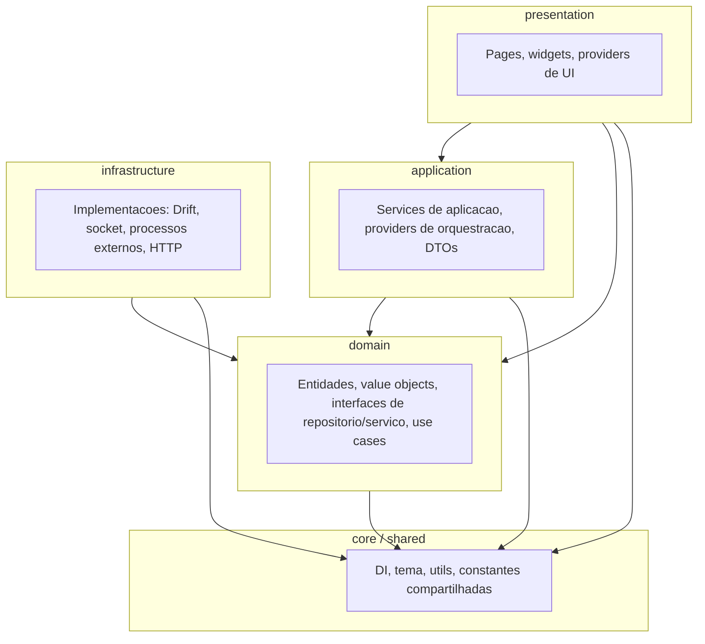

# Visao geral da arquitetura

O **backup_database** segue **Clean Architecture** com **DDD**, com
codigo organizado **por camada (layer-first)** — decisao **ADR-005**
(`docs/adr/005-layer-first-code-organization.md`).

## Fluxo de dependencias

Setas indicam **“depende de”** (codigo de cima usa abstracoes e tipos
das camadas abaixo).

## Regras de import (resumo)

| De / Para | `domain` | `application` | `infrastructure` | `presentation` |
| --- | --- | --- | --- | --- |
| `domain` | sim | nao | nao | nao |
| `application` | sim | sim | nao | nao |
| `infrastructure` | sim | nao | sim | nao |
| `presentation` | sim | sim | nao | sim |

Detalhe normativo: `.cursor/rules/clean_architecture.mdc` e
`project_specifics.mdc` (regras do repositorio).

## Onde aprofundar

| Topico | Documento |
| --- | --- |
| Ports genericos por SGBD | `docs/adr/004-generic-hexagonal-ports-sgbds.md` |
| Design system / tema | `docs/adr/009-design-system-themeextension-composition.md` |
| Helpers obrigatorios (repos, providers, bytes, …) | `.cursor/rules/architectural_patterns.mdc` |
| Novo motor de banco (passo a passo) | [adicionar_sgbd.md](adicionar_sgbd.md) |
| Widgets e tokens | [design_system.md](design_system.md) |
| Licenciamento (cadeia, env, revogação) | [licenciamento.md](licenciamento.md) |
| Indice de ADRs | [../adr/README.md](../adr/README.md) |
