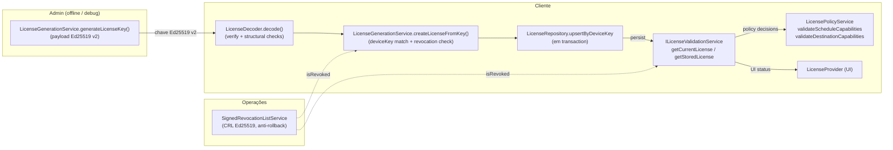

# Onboarding — Licenciamento

Resumo curto do fluxo de licenciamento do `backup_database`. Para o
"porque" detalhado, ver **ADR-016**
(`docs/adr/016-licensing-audit-secret-handling-and-revocation.md`).
Para padrões obrigatórios, ver **`.cursor/rules/architectural_patterns.mdc §10`**.

## Cadeia ponta a ponta



## Camadas principais

| Camada | Arquivos chave |
|---|---|
| Domain | `lib/domain/entities/license.dart` (`isExpired`, `isNotYetValid`, `isValid`); `lib/domain/services/i_license_validation_service.dart`; `lib/domain/services/i_license_policy_service.dart`; `lib/domain/services/i_revocation_checker.dart`; `lib/domain/repositories/i_license_repository.dart` |
| Application | `lib/application/services/license_decoder.dart` (Ed25519 verify); `lib/application/services/license_generation_service.dart`; `lib/application/services/license_validation_service.dart`; `lib/application/services/cached_license_validation_service.dart` (TTL 5s); `lib/application/services/license_policy_service.dart` (cache por `runId`); `lib/application/services/revocation_check_helper.dart` (helper único); `lib/application/services/admin_password_verifier.dart` (PBKDF2 + lockout); `lib/application/providers/license_provider.dart` |
| Infrastructure | `lib/infrastructure/license/ed25519_license_verifier.dart`; `lib/infrastructure/license/signed_revocation_list_service.dart` (anti-rollback); `lib/infrastructure/license/revocation_list_issued_at_store.dart`; `lib/infrastructure/repositories/license_repository.dart` (upsert em transaction); `lib/infrastructure/external/system/device_key_service.dart` (memoizado); `lib/infrastructure/datasources/local/tables/licenses_table.dart` (com `not_before`) |
| Presentation | `lib/presentation/widgets/settings/license_settings_tab.dart` (status + gerador admin gated) |
| Core (guard) | `lib/core/config/environment_loader.dart` — `forbiddenInBundledAssetKeys` |

## Configuração obrigatória

### Em qualquer ambiente

- `BACKUP_DATABASE_LICENSE_PUBLIC_KEY` (base64, 32 bytes Ed25519) **no
  `.env` do repo** (é OK ser asset — é a chave de verificação).
  Mapeada implicitamente para `keyId = ed25519-1`.

- Opcional, para rotação:
  `BACKUP_DATABASE_LICENSE_PUBLIC_KEYS` (JSON
  `{"ed25519-1": "...", "ed25519-2": "..."}`). Mescla com a chave
  legacy; precedência para o JSON em colisão de `keyId`.

### Em dev/admin (NUNCA no asset bundled)

Coloque em `C:\ProgramData\BackupDatabase\config\.env`:

```bash
# Chave privada Ed25519 para emitir licenças (64 bytes base64).
# Gere com: dart run scripts/generate_license_keypair.dart
BACKUP_DATABASE_LICENSE_PRIVATE_KEY=<base64>

# keyId que NOVAS licenças geradas vão carregar no payload.
# Default: ed25519-1. Mude para ed25519-2 (ou outro) durante rotação.
BACKUP_DATABASE_LICENSE_ACTIVE_KEY_ID=ed25519-1

# Hash da senha admin do gerador embutido.
# Gere com: dart run scripts/hash_admin_password.dart 'minhasenha'
LICENSE_ADMIN_PASSWORD_HASH=pbkdf2-sha256$200000$...$...

# Opcional: lista de revogação assinada.
BACKUP_DATABASE_LICENSE_REVOCATION_LIST_PATH=C:\ProgramData\BackupDatabase\config\revocation_list.json
```

### Em produção (cliente)

- Apenas `BACKUP_DATABASE_LICENSE_PUBLIC_KEY` (do bundled `.env`) e —
  opcional — `BACKUP_DATABASE_LICENSE_REVOCATION_LIST_PATH` no `.env`
  externo se quiser CRL.
- Os outros valores ficam **vazios** no `.env` do repo. O teste
  `test/unit/core/config/bundled_env_secret_leak_test.dart` quebra a
  PR se alguém tentar vazar.

## "Como faço para…"

### …rotacionar a chave Ed25519 (key rotation graceful)?

A chave atual deve ser rotacionada quando:

- Ela foi exposta acidentalmente (ex.: commitada no `.env` versionado e
  já replicada em git history — caso que motivou ADR-016).
- Como prática preventiva periódica (a cada N meses).
- Após dispensar admin que tinha acesso à private key.

O sistema suporta **rotação graceful**: a chave antiga continua válida
para licenças já emitidas enquanto a chave nova é introduzida.

**Passos:**

1. Em uma máquina dev/admin, gere o novo par:

   ```bash
   dart run scripts/generate_license_keypair.dart ed25519-2
   ```

   O script imprime `publicKeyBase64` e `privateKeyBase64`, além de
   instruções específicas para o seu caso.

2. **No `.env` do repositório** (asset bundled), substitua a entrada
   única por um JSON com as duas chaves:

   ```bash
   # Mantém a chave antiga aceita para licenças já emitidas:
   BACKUP_DATABASE_LICENSE_PUBLIC_KEYS={"ed25519-1": "<chave_antiga_base64>", "ed25519-2": "<chave_nova_base64>"}
   ```

   Você pode opcionalmente também deixar `BACKUP_DATABASE_LICENSE_PUBLIC_KEY=`
   apontando para a chave antiga (legacy) — o decoder mescla as duas
   fontes com prioridade para o JSON.

3. **No `.env` externo** (`C:\ProgramData\BackupDatabase\config\.env`)
   de cada estação admin:

   ```bash
   BACKUP_DATABASE_LICENSE_PRIVATE_KEY=<chave_nova_privada_base64>
   BACKUP_DATABASE_LICENSE_ACTIVE_KEY_ID=ed25519-2
   ```

4. Faça build e distribua para todos os clientes. Eles **continuam**
   aceitando licenças `ed25519-1` enquanto migram.

5. Re-emita as licenças ativas usando o gerador (agora assina com
   `ed25519-2`).

6. Quando todos os clientes tiverem licenças `ed25519-2`, **remova**
   a entrada `ed25519-1` do JSON `BACKUP_DATABASE_LICENSE_PUBLIC_KEYS`
   no `.env` do repo, refaça build e distribua. Licenças antigas
   passam a ser rejeitadas (`keyId desconhecido: ed25519-1`).

**Verificação:**

- Log de boot: `LicenseGenerationService initialized with
  activeKeyId="ed25519-2" (decoder accepts: ed25519-1, ed25519-2)`.
- Diretamente no decoder em testes/REPL: `decoder.acceptedKeyIds`.
- Licença gerada: o payload contém `"keyId": "ed25519-2"` (visível
  fazendo `base64 -d` da chave e extraindo o `data.keyId`).

### …emitir uma licença para um cliente?

1. Pegue o `deviceKey` do cliente (ele copia da tela de Licenciamento).
2. Em uma máquina dev com `BACKUP_DATABASE_LICENSE_PRIVATE_KEY`
   configurada e em `kDebugMode`, abra o app → Configurações →
   Licenciamento → Acessar gerador → digite a senha admin → preencha
   `deviceKey`, features e `expiresAt`.
3. Copie a chave gerada (base64) e envie ao cliente. Ele cola na tela
   de Licenciamento dele e clica em "Validar licença".

### …revogar uma licença?

1. Edite o JSON da CRL (formato `{ "data": { "revokedDeviceKeys": [...], "issuedAt": "ISO-8601", "expiresAt": "ISO-8601?" }, "signature": "base64" }`).
2. **Importante**: o `issuedAt` da nova CRL precisa ser **estritamente
   maior** que o último aceito pelo cliente — se você publicar uma
   CRL com `issuedAt` retroativo, o anti-rollback do
   `SignedRevocationListService` rejeita.
3. Assine com a private key (`ed25519_edwards.sign(...)`), salve no
   path apontado por `BACKUP_DATABASE_LICENSE_REVOCATION_LIST_PATH`
   ou base64 em `BACKUP_DATABASE_LICENSE_REVOCATION_LIST`.
4. O cliente vai recarregar a CRL no próximo `isRevoked()` (cache TTL
   15min por default — ver `LicenseConstants.revocationListTtl`).

### …gerar/atualizar o hash da senha admin?

```bash
dart run scripts/hash_admin_password.dart 'minhaSenhaForte123!'
```

Copie o output em `LICENSE_ADMIN_PASSWORD_HASH=...` no `.env` externo
de cada estação dev/admin.

### …adicionar uma feature nova de licença?

1. Adicione constante em `lib/core/constants/license_features.dart`
   (e na lista `allFeatures`).
2. Adicione check no `LicensePolicyService` se a feature está
   associada a propriedade de `Schedule` (ex.: `enableChecksum`).
3. Adicione label de UI em `_getFeatureLabel` em
   `lib/presentation/widgets/settings/license_settings_tab.dart`.
4. Inclua a feature no payload das licenças que devem tê-la (re-emita
   as licenças afetadas).

### …entender por que minha feature aparece negada na UI?

Olhe os logs (`LoggerService.debug`/`warning`):

- `isFeatureAllowed("<feature>") = false` — vem de
  `LicenseValidationService.isFeatureAllowed`, com causa raiz (sem
  licença, expirada, etc).
- `LicenseProvider.isFeatureAllowed("<feature>") = false` — fail-closed
  geral; raro, só em erros técnicos.
- `Sem fonte de revogação configurada` — quando o `IRevocationChecker`
  é null/sem env (fail-open, log único).

## Anti-patterns (linkados em §10 do `architectural_patterns.mdc`)

- ❌ Comitar `BACKUP_DATABASE_LICENSE_PRIVATE_KEY` no `.env` do repo.
- ❌ `revocationChecker?.isRevoked(deviceKey) ?? false` direto —
  use `RevocationCheckHelper.isRevokedSafe`.
- ❌ `getCurrentLicense` para mostrar status na UI (esconde licenças
  expiradas) — use `getStoredLicense`.
- ❌ Comparar senha admin em texto plano — use `AdminPasswordVerifier`.
- ❌ Cache de feature no `LicensePolicyService` chaveado por algo que
  não seja `runId`.

## Próximos passos sugeridos (não escopo da auditoria atual)

- **Rotacionar a chave privada Ed25519**: a chave atual está no git
  history → considere comprometida. A infraestrutura para rotação
  graceful está pronta (ver seção "…rotacionar a chave Ed25519" acima);
  é uma operação manual.
- **JSON canônico (RFC 8785)** na assinatura — proteção contra
  mudanças futuras do `jsonEncode` do SDK (ver Opção A do ADR-016).
- **Mover gerador admin para binário separado**, fora do bundle cliente
  (ver Opção B do ADR-016).
